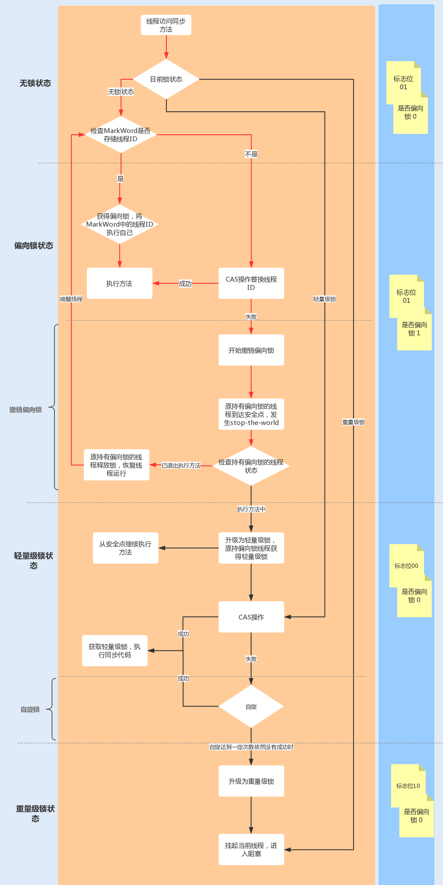

synchronized 是 Java 中用于实现线程同步的关键字,它可以用于方法或代码块,确保在同一时刻只有一个线程可以访问被同步的代码区域(其他线程等待锁)。这有助于避免多线程并发访问共享资源时可能引发的数据竞争和不确定性问题。

Synchronized 是 JVM 实现的一种内置锁,锁的获取和释放是由 JVM 隐式实现。JDK1.5 版本,JUC 中新增了 Lock 接口来实现锁功能,它提供了与 Synchronized 关键字类似的同步功能,只是在使用时需要显示获取和释放锁,也被称为显式锁。Lock 同步锁是基于 Java 实现的,而 Synchronized 是基于底层操作系统的 Mutex Lock 实现的,每次获取和释放锁操作都会带来用户态和内核态的切换,从而增加系统性能开销。因此,在锁竞争激烈的情况下,Synchronized 同步锁在性能上就表现得非常糟糕,也被称为重量级锁。但在 JDK1.6 版本之后,Java 对 Synchronized 同步锁做了充分的优化,甚至在某些场景下,它的性能已经超越了 Lock 同步锁。

## 1.synchronized 实现原理

### 1.1 synchronized 使用方式

synchronized 使用同步锁有两种方式:

- synchronized 修饰方法:synchronized 修饰方法时,该方法被称为同步方法,其锁对象指向当前实例,作用范围是当前方法。synchronized 修饰静态方法时,该方法被称为同步静态方法,其锁对象指向类实例,作用范围是整个类。
- synchronized 修饰代码块:synchronized 修饰代码块时,该代码块被称为同步代码块,其锁对象指向 synchronized 括号中的对象。

```java
// synchronized 修饰实例方法,锁对象指向当前实例
public synchronized void syncMethod01() {
    // code...
}
// synchronized 修饰静态方法,锁对象指向当前类
public static synchronized void syncMethod02() {
	// code...
}

// synchronized修饰代码块,锁对象指向synchronized括号中的对象
public synchronized void syncMethod03(){
    Object o = new Object();
    // 锁对象为o
    synchronized (o) {
        // code...
    }
}
```

同步方法与同步代码块的区别:

- 锁的范围不同。同步方法是方法级别锁,当使用 synchronized 修饰一个方法时,整个方法体成为了一个同步块,这意味着在同一时刻只有一个线程可以执行该方法。如果有多个同步方法,不同方法之间的锁是不冲突的,即可以并发执行不同的同步方法。同步代码块是代码块级别锁,当使用 synchronized 修饰一个代码块时,只有这个代码块中的内容被锁定,其他非同步的代码块仍然可以并发执行。多个线程可以同时执行不同代码块,只有当它们尝试进入同一个被锁定的代码块时才会互斥。
- 加锁方式不同。方法级别的锁比较方便,不需要显式地指定锁对象,而是使用方法的隐式锁(实例锁或类锁,取决于方法是实例方法还是静态方法)。代码块级别的锁需要显式地指定锁对象,允许更精细地控制锁的范围。
- 性能效率不同。方法级别的锁可能会导致性能问题,因为同一实例的其他非同步方法也会被阻塞,从而降低并发性能。 代码块级别的锁能够减少锁的范围,从而提高并发性能。但如果不合理地设计锁的粒度,也可能导致性能问题。
- 使用场景不同。同步方法用于解决同一实例的多个方法互斥执行,而同步代码块常用于实现更细粒度的并发控制,或者需要跨方法的互斥。

### 1.2 synchronized 原理

```java
package com.fly;
public class SyncTest {
    private static int i = 0;
    public synchronized void method01(){
        i++;
    }
    public void method02(){
        Object o = new Object();
        synchronized (o) {
            i++;
        }
    }
}
```

将以上代码通过反编译看下具体字节码的实现,运行以下反编译命令输出字节码:

```shell
# 通过Java编译器编译为class文件
javac -encoding UTF-8 SyncTest.java
# 通过javap命令将class文件打印为字节码文件
javap -v SyncTest.class
```

字节码内容如下:

```shell
Classfile /Users/study/repository/wuhu-boot/wuhu-boot-system/src/main/java/com/fly/SyncTest.class
  Last modified 2023年8月22日; size 523 bytes
  SHA-256 checksum 317b61ec405cafddba5494191cc5ae8c743c766e590bac89558f8cb1eef5b1de
  Compiled from "SyncTest.java"
public class com.fly.SyncTest
  minor version: 0
  major version: 61
  flags: (0x0021) ACC_PUBLIC, ACC_SUPER
  this_class: #8                          // com/fly/SyncTest
  super_class: #2                         // java/lang/Object
  interfaces: 0, fields: 1, methods: 4, attributes: 1
Constant pool:
   #1 = Methodref          #2.#3          // java/lang/Object."<init>":()V
   #2 = Class              #4             // java/lang/Object
   #3 = NameAndType        #5:#6          // "<init>":()V
   #4 = Utf8               java/lang/Object
   #5 = Utf8               <init>
   #6 = Utf8               ()V
   #7 = Fieldref           #8.#9          // com/fly/SyncTest.i:I
   #8 = Class              #10            // com/fly/SyncTest
   #9 = NameAndType        #11:#12        // i:I
  #10 = Utf8               com/fly/SyncTest
  #11 = Utf8               i
  #12 = Utf8               I
  #13 = Utf8               Code
  #14 = Utf8               LineNumberTable
  #15 = Utf8               method01
  #16 = Utf8               method02
  #17 = Utf8               StackMapTable
  #18 = Class              #19            // java/lang/Throwable
  #19 = Utf8               java/lang/Throwable
  #20 = Utf8               <clinit>
  #21 = Utf8               SourceFile
  #22 = Utf8               SyncTest.java
{
  public com.fly.SyncTest();
    descriptor: ()V
    flags: (0x0001) ACC_PUBLIC
    Code:
      stack=1, locals=1, args_size=1
         0: aload_0
         1: invokespecial #1                  // Method java/lang/Object."<init>":()V
         4: return
      LineNumberTable:
        line 2: 0

  public synchronized void method01();
    descriptor: ()V
    flags: (0x0021) ACC_PUBLIC, ACC_SYNCHRONIZED
    Code:
      stack=2, locals=1, args_size=1
         0: getstatic     #7                  // Field i:I
         3: iconst_1
         4: iadd
         5: putstatic     #7                  // Field i:I
         8: return
      LineNumberTable:
        line 5: 0
        line 6: 8

  public void method02();
    descriptor: ()V
    flags: (0x0001) ACC_PUBLIC
    Code:
      stack=2, locals=4, args_size=1
         0: new           #2                  // class java/lang/Object
         3: dup
         4: invokespecial #1                  // Method java/lang/Object."<init>":()V
         7: astore_1
         8: aload_1
         9: dup
        10: astore_2
        11: monitorenter
        12: getstatic     #7                  // Field i:I
        15: iconst_1
        16: iadd
        17: putstatic     #7                  // Field i:I
        20: aload_2
        21: monitorexit
        22: goto          30
        25: astore_3
        26: aload_2
        27: monitorexit
        28: aload_3
        29: athrow
        30: return
      Exception table:
         from    to  target type
            12    22    25   any
            25    28    25   any
      LineNumberTable:
        line 8: 0
        line 9: 8
        line 10: 12
        line 11: 20
        line 12: 30
      StackMapTable: number_of_entries = 2
        frame_type = 255 /* full_frame */
          offset_delta = 25
          locals = [ class com/fly/SyncTest, class java/lang/Object, class java/lang/Object ]
          stack = [ class java/lang/Throwable ]
        frame_type = 250 /* chop */
          offset_delta = 4

  static {};
    descriptor: ()V
    flags: (0x0008) ACC_STATIC
    Code:
      stack=1, locals=0, args_size=0
         0: iconst_0
         1: putstatic     #7                  // Field i:I
         4: return
      LineNumberTable:
        line 3: 0
}
SourceFile: "SyncTest.java"
```

从编译后的字节码文件来看:当使用 synchronized 修饰代码块时,是由 monitorenter 和 monitorexit 指令来实现同步的。进入 monitorenter 指令后,线程将持有 Monitor(监视器)对象,退出 monitorenter 指令后,线程将释放该 Monitor 对象。

```shell
public void method02();
    descriptor: ()V
    flags: (0x0001) ACC_PUBLIC
    Code:
      stack=2, locals=4, args_size=1
         0: new           #2                  // class java/lang/Object
         3: dup
         4: invokespecial #1                  // Method java/lang/Object."<init>":()V
         7: astore_1
         8: aload_1
         9: dup
        10: astore_2
        11: monitorenter
        12: getstatic     #7                  // Field i:I
        15: iconst_1
        16: iadd
        17: putstatic     #7                  // Field i:I
        20: aload_2
        21: monitorexit
        22: goto          30
        25: astore_3
        26: aload_2
        27: monitorexit
        28: aload_3
        29: athrow
        30: return
      Exception table:
         from    to  target type
            12    22    25   any
            25    28    25   any
      LineNumberTable:
        line 8: 0
        line 9: 8
        line 10: 12
        line 11: 20
        line 12: 30
      StackMapTable: number_of_entries = 2
        frame_type = 255 /* full_frame */
          offset_delta = 25
          locals = [ class com/fly/SyncTest, class java/lang/Object, class java/lang/Object ]
          stack = [ class java/lang/Throwable ]
        frame_type = 250 /* chop */
          offset_delta = 4
```

从编译后的字节码文件来看:当使用 synchronized 修饰方法时,并没有使用 monitorenter 和 monitorexit 指令,而是使用了 ACC_SYNCHRONIZED 访问标志来区分一个方法是否是同步方法。如果设置了该标志,执行线程将先持有 Monitor 对象,然后再执行方法。在该方法运行期间,其它线程将无法获取到该 Mointor 对象,当方法执行完成后,再释放该 Monitor 对象。

```java
public synchronized void method01();
    descriptor: ()V
    flags: (0x0021) ACC_PUBLIC, ACC_SYNCHRONIZED
    Code:
      stack=2, locals=1, args_size=1
         0: getstatic     #7                  // Field i:I
         3: iconst_1
         4: iadd
         5: putstatic     #7                  // Field i:I
         8: return
      LineNumberTable:
        line 5: 0
        line 6: 8
```

synchronized 修饰方法时实现内置锁的原理如下:JVM 中的同步是基于进入和退出管程(Monitor)对象实现的。每个对象实例都会有一个 Monitor,Monitor 可以和对象一起创建、销毁。Monitor 是由 ObjectMonitor 实现,而 ObjectMonitor 是由 C++ 的 ObjectMonitor.hpp 文件实现,其源码如下:

```shell
ObjectMonitor() {
   _header = NULL;
   _count = 0; // 记录个数
   _waiters = 0,
   _recursions = 0;
   _object = NULL;
   _owner = NULL;
   _WaitSet = NULL; // 处于 wait 状态的线程，会被加入到 _WaitSet
   _WaitSetLock = 0 ;
   _Responsible = NULL ;
   _succ = NULL ;
   _cxq = NULL ;
   FreeNext = NULL ;
   _EntryList = NULL ; // 处于等待锁 block 状态的线程，会被加入到该列表
   _SpinFreq = 0 ;
   _SpinClock = 0 ;
   OwnerIsThread = 0 ;
}
```

当多个线程同时访问一段同步代码时,多个线程会先被存放在 EntryList 集合中,处于 block 状态的线程,都会被加入到该列表。接下来当线程获取到对象的 Monitor 时,Monitor 是依靠底层操作系统的 Mutex Lock(互斥锁)来实现互斥的,线程申请 Mutex 成功,则持有该 Mutex,其它线程将无法获取到该 Mutex。 如果线程调用 wait() 方法,就会释放当前持有的 Mutex,并且该线程会进入 WaitSet 集合中,等待下一次被唤醒。如果当前线程顺利执行完方法,也将释放 Mutex。流程图如下:

synchronized 实现同步锁依赖于 Monitor 对象,Monitor 依赖于底层的操作系统实现,在加锁和释放锁过程存在用户态与内核态之间的切换,所以增加了性能开销。

## 2.synchronized 优化

### 2.1 synchronized 锁升级优化

为了提升 synchronized 的性能,JDK1.6 引入了偏向锁、轻量级锁、重量级锁概念,来锁竞争带来的上下文切换。当使用 synchronized 修饰方法或代码块时,synchronized 内置锁的锁升级过程都将和锁对象的对象头有关。当方法调用时,调用指令将会检查该方法是否被设置 ACC_SYNCHRONIZED 访问标志。如果设置了该标志,执行线程将先持有 Monitor 对象,然后再执行方法。在该方法运行期间,其它线程将无法获取到该 Mointor 对象,当方法执行完成后,再释放该 Monitor 对象。

#### 2.1.1 对象头

在 JDK1.6 JVM 中,对象实例在堆内存中被分为了三个部分:对象头、实例数据和对齐填充。其中 Java 对象头由 Mark Word、指向类的指针以及数组长度三部分组成。Mark Word 记录了对象和锁有关的信息。Mark Word 在 64 位 JVM 中的长度是 64bit,64 位 JVM 的存储结构如下:

锁升级功能主要依赖于 Mark Word 中的锁标志位和释放偏向锁标志位,Synchronized 初始化时使用偏向锁,随着线程竞争越来越激烈,偏向锁升级到轻量级锁,最终升级到重量级锁。随着锁升级的过程 Synchronized 的性能也会变得越来越差。

#### 2.1.2 偏向锁

**偏向锁主要用来优化同一线程多次申请同一个锁的竞争**。在某些情况下,大部分时间是同一个线程竞争锁资源,例如,在创建一个线程并在线程中执行循环监听的场景下,或单线程操作一个线程安全集合时,同一线程每次都需要获取和释放锁,每次操作都会发生用户态与内核态的切换。

偏向锁的作用就是,当一个线程再次访问这个同步代码或方法时,该线程只需去对象头的 Mark Word 中去判断一下是否有偏向锁指向它的线程 ID,无需再进入 Monitor 去竞争对象。**当对象被当做同步锁并有一个线程抢到了锁时,锁标志位还是 01,"是否偏向锁"标志位设置为 1,并且记录抢到锁的线程 ID,表示进入偏向锁状态**。 一旦出现其它线程竞争锁资源时,偏向锁就会被撤销。偏向锁的撤销需要等待全局安全点,暂停持有该锁的线程,同时检查该线程是否还在执行该方法,如果是则进行锁升级,反之则被其它线程抢占。

在高并发场景下,当大量线程同时竞争同一个锁资源时,偏向锁就会被撤销,发生 stop the word 后,开启偏向锁无疑会带来更大的性能开销,这时可以通过添加 JVM 参数关闭偏向锁来调优系统性能,示例代码如下:

```java
-XX:-UseBiasedLocking // 关闭偏向锁（默认打开）
```

或者:

```java
-XX:+UseHeavyMonitors  // 设置重量级锁
```

#### 2.1.3 轻量级锁

如果当前是偏向锁,且有另一个线程获取该锁时,由于该锁已经是偏向锁,当发现对象头 Mark Word 中的线程 ID 不是自己的线程 ID,就会进行 CAS 操作获取锁,如果获取成功,直接替换 Mark Word 中的线程 ID 为自己的 ID,该锁会保持偏向锁状态;如果获取锁失败,代表当前锁有一定的竞争,偏向锁将升级为轻量级锁。轻量级锁适用于线程交替执行同步块的场景,绝大部分的锁在整个同步周期内都不存在长时间的竞争。


#### 2.1.4 自旋锁和重量级锁

轻量级锁 CAS 抢锁失败,线程将会被挂起进入阻塞状态。如果正在持有锁的线程在很短的时间内释放资源,那么进入阻塞状态的线程无疑又要申请锁资源。
为了避免频繁申请锁资源,JVM 提供了一种自旋锁,可以通过自旋方式不断尝试获取锁,从而避免线程被挂起阻塞。这是基于大多数情况下,线程持有锁的时间都不会太长，毕竟线程被挂起阻塞可能会得不偿失。 从 JDK1.7 开始,自旋锁默认启用,自旋次数由 JVM 设置决定,不建议设置的重试次数过多,因为 CAS 重试操作意味着长时间地占用 CPU。如果自旋锁重试之后如果抢锁依然失败,同步锁就会升级至重量级锁,锁标志位改为 10。在这个状态下,未抢到锁的线程都会进入 Monitor,之后会被阻塞在 \_WaitSet 队列中。自旋锁升级为重量级锁过程如下图:

在锁竞争不激烈且锁占用时间非常短的场景下,自旋锁可以提高系统性能。一旦锁竞争激烈或锁占用的时间过长,自旋锁将会导致大量的线程一直处于 CAS 重试状态,占用 CPU 资源,反而会增加系统性能开销。所以自旋锁和重量级锁的使用都要结合实际场景。 在高负载、高并发的场景下,可以通过设置 JVM 参数来关闭自旋锁,优化系统性能,示例代码如下:

```java
-XX:-UseSpinning // 参数关闭自旋锁优化 (默认打开)
-XX:PreBlockSpin // 参数修改默认的自旋次数。JDK1.7 后，去掉此参数，由 jvm 控制
```

### 2.2 动态编译实现锁消除 / 锁粗化

除了锁升级优化,Java 还使用了编译器对锁进行优化。JIT 编译器在动态编译同步块的时候,借助了一种被称为逃逸分析的技术,来判断同步块使用的锁对象是否只能够被一个线程访问,而没有被发布到其它线程。 确认是的话,那么 JIT 编译器在编译这个同步块的时候不会生成 synchronized 所表示的锁的申请与释放的机器码,即消除了锁的使用。在 Java7 之后的版本无需手动配置,该操作可以自动实现。

锁粗化同理,就是在 JIT 编译器动态编译时,如果发现几个相邻的同步块使用的是同一个锁实例,那么 JIT 编译器将会把这几个同步块合并为一个大的同步块,从而避免一个线程“反复申请、释放同一个锁“所带来的性能开销。

### 2.3 减小锁粒度

除了锁内部优化和编译器优化之外,还可以在代码层面来实现锁优化,减小锁粒度就是一种常用的一种方式。当锁对象是一个数组或队列时,多个线程集中竞争一个对象的情况下会非常激烈,锁也会升级为重量级锁。因此可以考虑将一个数组和队列对象拆成多个小对象,来降低锁竞争,提升并行度。
最经典的减小锁粒度的案例就是 JDK1.8 之前实现的 ConcurrentHashMap 版本。由于 HashTable 是基于一个数组和链表实现的,所以在并发读写操作集合时,存在激烈的锁资源竞争,也因此性能会存在瓶颈。而 ConcurrentHashMap 就很很巧妙地使用了分段锁 Segment 来降低锁资源竞争

## 3.总结

synchronized 修饰代码块和方法其底层实现不同:

- 修饰同步块:当使用 synchronized 修饰代码块时,是由 monitorenter 和 monitorexit 指令来实现同步的。进入 monitorenter 指令后,线程将持有 Monitor(监视器)对象,退出 monitorenter 指令后,线程将释放该 Monitor 对象。
- 修饰方法:当使用 synchronized 修饰方法时,并没有使用 monitorenter 和 monitorexit 指令,而是使用了 ACC_SYNCHRONIZED 访问标志来区分一个方法是否是同步方法。如果设置了该标志,执行线程将先持有 Monitor 对象,然后再执行方法。在该方法运行期间,其它线程将无法获取到该 Mointor 对象,当方法执行完成后,再释放该 Monitor 对象。在 Java 中每个对象实例都会有一个 Monitor,Monitor 可以和对象一起创建、销毁。

synchronized 是基于底层操作系统的 Mutex Lock(互斥锁)实现的,每次获取和释放锁操作都会带来用户态和内核态的切换,从而增加系统性能开销。为了提升性能,JVM 在 JDK1.6 中引入了分级锁机制来优化 Synchronized,当一个线程获取锁时,首先对象锁将成为一个偏向锁,这样做是为了优化同一线程重复获取导致的用户态与内核态的切换问题;其次如果有多个线程竞争锁资源,锁将会升级为轻量级锁,它适用于在短时间内持有锁,且分锁有交替切换的场景;偏向锁还使用了自旋锁来避免线程用户态与内核态的频繁切换,大大地提高了系统性能;但如果锁竞争太激烈了,那么同步锁将会升级为重量级锁。
synchronized 主要有两种策略来优化其性能:

- 减少锁竞争。减少锁竞争,是优化 Synchronized 同步锁的关键。应尽量使 Synchronized 同步锁处于轻量级锁或偏向锁,这样可以提高 Synchronized 同步锁的性能。
- 减小锁粒度。通过减小锁粒度来降低锁竞争也是一种最常用的优化方法;另外还可以通过减少锁的持有时间来提高 Synchronized 同步锁在自旋时获取锁资源的成功率,避免 Synchronized 同步锁升级为重量级锁。
