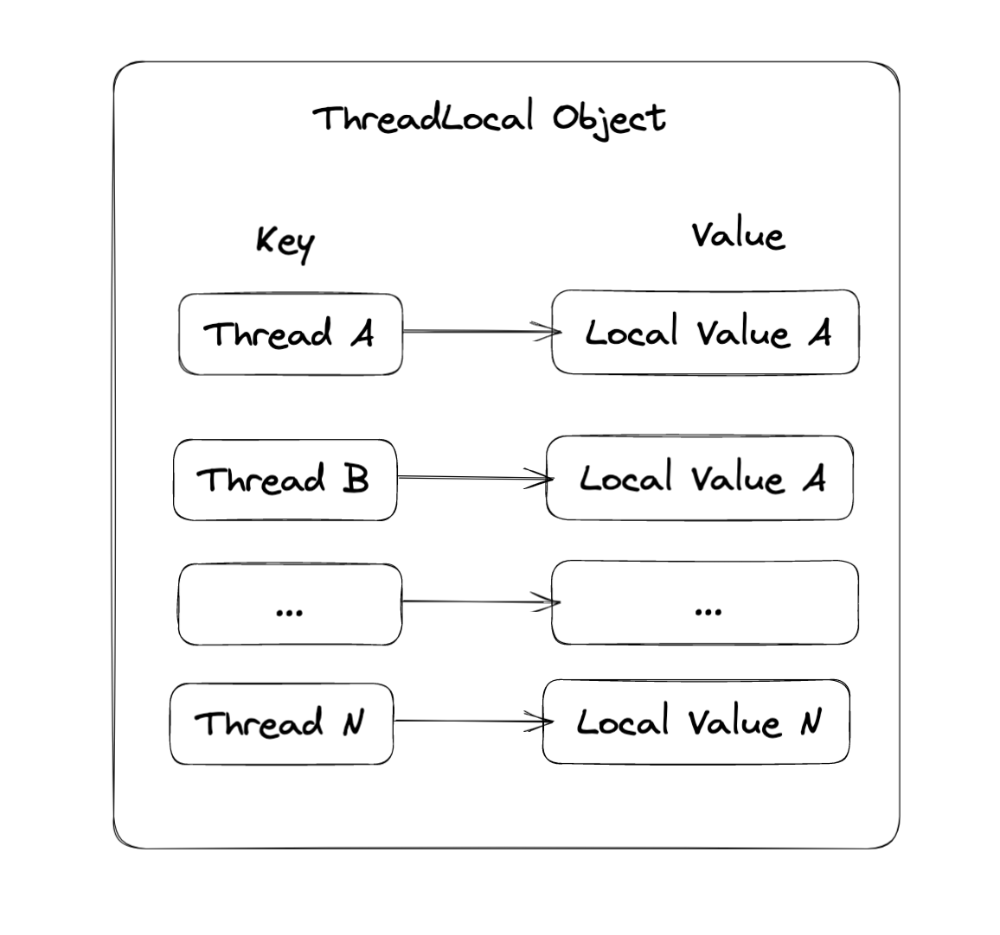
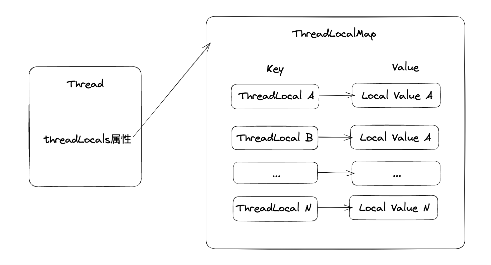
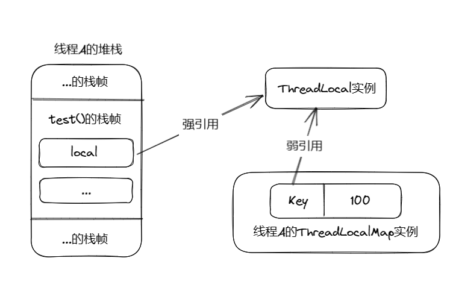

## 1.ThreadLocal 介绍

ThreadLocal 位于 JDK 的 java.lang 核心包中。**ThreadLocal 表示"线程本地变量"或"线程局部变量类",用于多线程并发执行中保证多个线程对变量的安全访问,从而避免多线程对同一变量操作造成线程安全问题。在访问 ThreadLocal 存储的变量值时,每个线程都有一个独立的的本地值,"线程本地变量"可以看成专属于线程的变量,不受其他线程干扰,其内部保存着线程的专属数据。当线程结束后,每个线程所拥有的本地值会被释放。在多线程并发操作"线程本地变量"时,本质上是线程操作各自的本地值,从而规避了线程安全问题。**
**简单来说,使用 ThreadLocal 能实现每个线程都有一份数据的本地值,每个线程都有独立的 ThreadLocalMap 空间用于存储数据,从而保证线程之间的本地数据是私有的,从本质来说 ThreadLocal 属于空间换时间的设计思路,该设计思路属于另一种意义的无锁编程。**

ThreadLocal 早期版本被设计成一个 Map 结构,当工作线程 Thread 实例向本地变量存储某个值时,会"Key-Value"对(键值对)的形式保存在 ThreadLocal 内部的 Map 中,其中 Key 为线程 Thread 实例,Value 为存储的值。当工作线程 Thread 实例从 ThreadLocal 本地变量读取值时,会以当前工作线程 Thread 实例为 Key,获取其对应的 Value。早期 ThreadLocal 实例内部结构如下:



ThreadLocal 提供如下成员方法:

```
void set(T value):设置当前线程在ThreadLocal实例中绑定的本地值。

T get():获取当前线程在ThreadLocal实例中绑定的本地值。

void remove():移除当前线程在ThreadLocal实例中绑定的本地值。

static <S> ThreadLocal<S> withInitial(Supplier<? extends S> supplier):一个创建ThreadLocal的工厂方法,用于定义ThreadLocal对象并设置一个获取初始值的回调函数,例如:ThreadLocal local=ThreadLocal.withInitial(()-> new Foo())。
```

```java
package com.fly.threadLocal;

import java.util.concurrent.ExecutorService;
import java.util.concurrent.Executors;
import java.util.concurrent.atomic.AtomicInteger;

/**
* ThreadLocal
*/
public class ThreadExample01 {
    static class Foo{

        // 实例总数
        static final AtomicInteger count = new AtomicInteger(0);
        // 对象编号
        int index=0;
        // 对象内容
        int bar=10;
        public Foo(){
            index = count.incrementAndGet();
        }
        @Override
        public String toString() {
            return "Foo{ bar=" + bar + " }";
        }

        public int getBar() {
            return bar;
        }

        public void setBar(int bar) {
            this.bar = bar;
        }
    }
    private static final ThreadLocal<Foo> local = new ThreadLocal<>();
    public static void main(String[] args) {
        // 通过Executors创建线程池
        ExecutorService pool = Executors.newCachedThreadPool();
        // 向线程池提交5个任务
        for (int i = 0; i < 5; i++) {
            pool.execute(new Runnable() {
                @Override
                public void run() {
                    // 获取当前线程名称
                    String threadName = Thread.currentThread().getName();
                    // 获取ThreadLocal中当前线程实例绑定的value
                    if (local.get() == null){
                        // 若threadLocal不存在则通过set存储
                        local.set(new Foo());
                    }
                    System.out.println(threadName+": 初识本地值:"+local.get());
                    // 每个线程执行10次
                    for (int j = 0; j < 10; j++) {
                        Foo foo = local.get();
                        foo.setBar(foo.getBar()+1);
                        try {
                            // 线程休眠10ms
                            Thread.sleep(10);
                        } catch (InterruptedException e) {
                            e.printStackTrace();
                        }
                    }
                    System.out.println(threadName+": 累加10次之后的本地值:"+local.get());
                    // 删除threadLocal当前线程所绑定的value,否则可能会出现内存泄漏
                    local.remove();
                }
            });
        }
        // 关闭线程池
        pool.shutdown();
    }
}

```

执行结果如下:

```java
pool-1-thread-1: 初识本地值:Foo{ bar=10 }
pool-1-thread-4: 初识本地值:Foo{ bar=10 }
pool-1-thread-2: 初识本地值:Foo{ bar=10 }
pool-1-thread-3: 初识本地值:Foo{ bar=10 }
pool-1-thread-5: 初识本地值:Foo{ bar=10 }
pool-1-thread-3: 累加10次之后的本地值:Foo{ bar=20 }
pool-1-thread-5: 累加10次之后的本地值:Foo{ bar=20 }
pool-1-thread-2: 累加10次之后的本地值:Foo{ bar=20 }
pool-1-thread-1: 累加10次之后的本地值:Foo{ bar=20 }
pool-1-thread-4: 累加10次之后的本地值:Foo{ bar=20 }
```

从执行结果来看,在 ThreadLocal 中每个线程都绑定了一个独立的值(Foo 对象),该对象值是线程私有的,可以理解为线程的本地值,而线程的每一次操作都是操作的是自己线程的值,所以在并发环境下并不会产生线程安全问题。

## 2.ThreadLocal 使用场景

ThreadLocal 是解决线程安全问题的一个优秀方案,它通过为每个线程提供一个独立的本地值去解决并发访问的冲突问题。**在很多情况下,使用 ThreadLocal 比直接使用同步机制(Synchronized)解决线程安全问题更简单、更方便,且具有更高的并发性**。ThreadLocal 的应用场景大致分为以下两类:

- **线程隔离**。ThreadLocal 的主要价值在于线程隔离,ThreadLocal 中的数据只属于当前线程,其本地值对于其他线程是不可见,在多线程环境下,可以防止当前线程存储的数据被其他线程篡改。另外,由于各个线程之间的数据相互隔离,避免了同步加锁带来的性能损失,大大提升了并发性的性能。ThreadLocal 在线程隔离场景最为典型的例子是用户会话管理(Session)、数据库连接、HTTP 请求等,每一个线程都绑定了一个会话管理(Session)、数据库连接、HTTP 请求等信息,这样一个线程所有调用到的处理函数都可以非常方便地访问这些资源。
- **跨函数传递**。通常同一线程内需要跨类或跨方法传递数据时,依赖于返回值或参数,这样可能会增加类或方法之间耦合度。由于 ThreadLocal 的特性,同一线程设置数据后,其他任意地方都获取。线程执行过程中所执行到的方法都能读写 ThreadLocal 变量的线程本地值,从而可以方便地实现跨方法的数据传递。使用 ThreadLocal 保存方法之间需要传递的数据,也可以避免传递数据带来的高耦合。

### 2.1 实现 ThreadLocal 实现线程隔离

数据库 Session 共享是 ThreadLocal 线程隔离最为经典的例子,例如 Hibernate 通过 ThreadLocal 存储的数据库连接(Session),从而实现数据库连接隔离:

```javascript
// Hibernate Session源码
private static final ThreadLocal threadSession = new ThreadLocal<>();

public static Session getSession() throws InfrastructureException{
  Session s = (Session) threadSession.get();
  try{
    if (s == null){
      getSessionFactory().openSession();
      threadSession.set(s);
    }
  } catch(HibernateException ex) {
    throw new InfrastructureException(ex);
  }
  return s;
}
```

Hibernate 对数据库连接进行了封装,一个 Session 表示一个数据库连接。在 Hibernate getSession()方法中,首先判断当前线程中是否存在 Session,如果不存在则通过 getSessionFactory.openSession()来创建创建一个 Session,并将创建后的 Session 保存到 ThreadLocal 中,这个 Session 是线程私有的,其他线程无法共享。

通常情况下,完成数据库操作后应用程序会关闭 Session,从而释放资源节省数据库连接资源。假设 Session 是线程共享的,如果某个线程使用完成后将 Session 关闭,其他线程在操作 Session 就会出现错误。为此,Hibernate 通过 ThreadLocal 非常简单实现了数据连接的安全使用。

### 2.2 使用 ThreadLocal 进行跨方法调用

ThreadLocal 在跨方法数据传递的场景有很多,例如:

- 用来传递请求过程中的用户 ID.
- 用来传递请求过程中的用户会话(Session)。
- 用来传递 HTTP 的用户请求实例 HttpRequest。
- 其他需要在方法之间频繁传递的数据。

例如微服务脚手架 Crazy-SpringCloud 工程,通过 ThreadLocal 在方法之间传递用户信息、会话信息等,并且封装成了一个独立的 SessionHolder 类,代码如下:

```javascript
// 省略import
public class SessionHolder{
    // session id，线程本地变量
    private static final ThreadLocal<String> sidLocal =new ThreadLocal<>("sidLocal");
    // 用户信息，线程本地变量
    private static final ThreadLocal<UserDTO> sessionUserLocal =new ThreadLocal<>("sessionUserLocal");
    // session，线程本地变量
    private static final ThreadLocal<HttpSession> sessionLocal =new ThreadLocal<>("sessionLocal");
    // 省略其他
    /** 保存session在线程本地变量中*/
    public static void setSession(HttpSession session){
         sessionLocal.set(session);
                                                           }
    /*** 取得绑定在线程本地变量中的session */
    public static HttpSession getSession(){
        HttpSession session = sessionLocal.get();
        Assert.notNull(session, "session未设置");
        return session;
    }
    // 省略其他
}
```

## 3.ThreadLocal 实现原理

### 3.1 ThreadLocal 原理介绍

**在早期 JDK 版本中,ThreadLocal 的内部结构是 Map,其中每一个线程实例作为 Map 的 Key,线程在 ThreadLocal 中绑定的值为 Value(本地值)。早期版本中的 Map 的结构的拥有者为 ThreadLocal,每一个 ThreadLocal 实例拥有一个 Map 实例。**
**在 JDK1.8 中,ThreadLocal 的内部结构发生了变化,内部虽然还是使用 Map 结构,但是 Map 结构的拥有者已经发生了变化,其拥有者为 Thread 实例,每一个 Thread 实例都拥有一个 Map 实例。另外,Map 结构的 Key 也发生了变化,新的 key 为 ThreadLocal 实例。在 JDK1.8 中,每一个 Thread 线程内部都有一个 Map(ThreadLocalMap),如果给一个 Thread 创建多个 ThreadLocal 实例,然后存储本地数据,那么当前线程的 ThreadLocalMap 中就会有多个 Key-Value 对,其中 ThreadLocal 实例为 Key,本地数据为 Value。**

从代码层面来看,新版本的 ThreadLocalMap 还是由 ThreadLocal 类维护,由 ThreadLocal 负责 ThreadLocalMap 实例的获取和创建,并从中设置本地值、获取本地值。所以 ThreadLocalMap 还寄存于 ThreadLocal 内部(ThreadLocalMap 是 ThreadLocal 类中的静态内部类),并没有迁移到 Thread 内部。ThreadLocalMap 结构如下:

每个线程在获取本地值时,都会将 ThreadLocal 实例作为 Key 从拥有的 ThreadLocalMap 中获取值,其他线程无法访问当前线程本地的 ThreadLocalMap,从而实现线程之间的相互隔离,互不干扰。对比早期 ThreadLocalMap 实现新版本的主要变化如下:

- **拥有者发生了变化:旧版 ThreadLocalMap 拥有者是 ThreadLocal,新版拥有者为 Thread。**
- **ThreadLocalMapKey 发生了变化:旧版 Key 指向 Thread 实例,新版 Key 指向 ThreadLocal 实例。**

新版本 ThreadLocalMap 实现的优势如下:

- **每个 ThreadLocalMap 存储的 Key-Value 对数据变少。早期版本的 Key-Value 数量与线程个数强关联,线程数据量和 ThreadMap 存储的 Key-Value 对是成正比。新版本的 ThreadLocalMap 的 Key 为 ThreadLocal 实例,多线程情况 ThreadLocal 实例比线程数量少很多。**
- **早期版本 ThreadMap 的拥有者为 ThreadLocal,在 Thread 实例销毁后,并不会销毁 ThreadLocalMap。新版的 ThreadLocalMap 拥有者为 Thread,线程实例销毁后,ThreadLocalMap 也会随之销毁,在一定程度上能减少内存的使用。**

ThreadLocal 类的源码如下:

```java
package java.lang;
import jdk.internal.misc.TerminatingThreadLocal;

import java.lang.ref.*;
import java.util.Objects;
import java.util.concurrent.atomic.AtomicInteger;
import java.util.function.Supplier;

public class ThreadLocal<T> {

    private final int threadLocalHashCode = nextHashCode();
    /**
     * The next hash code to be given out. Updated atomically. Starts at
     * zero.
     */
    private static AtomicInteger nextHashCode = new AtomicInteger();

    private static final int HASH_INCREMENT = 0x61c88647;

    private static int nextHashCode() {
        return nextHashCode.getAndAdd(HASH_INCREMENT);
    }

    protected T initialValue() {
        return null;
    }

    public static <S> ThreadLocal<S> withInitial(Supplier<? extends S> supplier) {
        return new SuppliedThreadLocal<>(supplier);
    }


    public ThreadLocal() {}

    public T get() {
        Thread t = Thread.currentThread();
        ThreadLocalMap map = getMap(t);
        if (map != null) {
            ThreadLocalMap.Entry e = map.getEntry(this);
            if (e != null) {
                @SuppressWarnings("unchecked")
                T result = (T)e.value;
                return result;
            }
        }
        return setInitialValue();
    }

    boolean isPresent() {
        Thread t = Thread.currentThread();
        ThreadLocalMap map = getMap(t);
        return map != null && map.getEntry(this) != null;
    }

    private T setInitialValue() {
        T value = initialValue();
        Thread t = Thread.currentThread();
        ThreadLocalMap map = getMap(t);
        if (map != null) {
            map.set(this, value);
        } else {
            createMap(t, value);
        }
        if (this instanceof TerminatingThreadLocal) {
            TerminatingThreadLocal.register((TerminatingThreadLocal<?>) this);
        }
        return value;
    }

    public void set(T value) {
        Thread t = Thread.currentThread();
        ThreadLocalMap map = getMap(t);
        if (map != null) {
            map.set(this, value);
        } else {
            createMap(t, value);
        }
    }

     public void remove() {
         ThreadLocalMap m = getMap(Thread.currentThread());
         if (m != null) {
             m.remove(this);
         }
     }

    ThreadLocalMap getMap(Thread t) {
        return t.threadLocals;
    }

    void createMap(Thread t, T firstValue) {
        t.threadLocals = new ThreadLocalMap(this, firstValue);
    }

    static ThreadLocalMap createInheritedMap(ThreadLocalMap parentMap) {
        return new ThreadLocalMap(parentMap);
    }

    T childValue(T parentValue) {
        throw new UnsupportedOperationException();
    }

    static final class SuppliedThreadLocal<T> extends ThreadLocal<T> {

        private final Supplier<? extends T> supplier;

        SuppliedThreadLocal(Supplier<? extends T> supplier) {
            this.supplier = Objects.requireNonNull(supplier);
        }

        @Override
        protected T initialValue() {
            return supplier.get();
        }
    }

    static class ThreadLocalMap {

        static class Entry extends WeakReference<ThreadLocal<?>> {
            /** The value associated with this ThreadLocal. */
            Object value;

            Entry(ThreadLocal<?> k, Object v) {
                super(k);
                value = v;
            }
        }

        /**
         * The initial capacity -- MUST be a power of two.
         */
        private static final int INITIAL_CAPACITY = 16;

        /**
         * The table, resized as necessary.
         * table.length MUST always be a power of two.
         */
        private Entry[] table;

        /**
         * The number of entries in the table.
         */
        private int size = 0;

        /**
         * The next size value at which to resize.
         */
        private int threshold; // Default to 0

        /**
         * Set the resize threshold to maintain at worst a 2/3 load factor.
         */
        private void setThreshold(int len) {
            threshold = len * 2 / 3;
        }

        /**
         * Increment i modulo len.
         */
        private static int nextIndex(int i, int len) {
            return ((i + 1 < len) ? i + 1 : 0);
        }

        /**
         * Decrement i modulo len.
         */
        private static int prevIndex(int i, int len) {
            return ((i - 1 >= 0) ? i - 1 : len - 1);
        }

        ThreadLocalMap(ThreadLocal<?> firstKey, Object firstValue) {
            table = new Entry[INITIAL_CAPACITY];
            int i = firstKey.threadLocalHashCode & (INITIAL_CAPACITY - 1);
            table[i] = new Entry(firstKey, firstValue);
            size = 1;
            setThreshold(INITIAL_CAPACITY);
        }

        private ThreadLocalMap(ThreadLocalMap parentMap) {
            Entry[] parentTable = parentMap.table;
            int len = parentTable.length;
            setThreshold(len);
            table = new Entry[len];

            for (int j = 0; j < len; j++) {
                Entry e = parentTable[j];
                if (e != null) {
                    @SuppressWarnings("unchecked")
                    ThreadLocal<Object> key = (ThreadLocal<Object>) e.get();
                    if (key != null) {
                        Object value = key.childValue(e.value);
                        Entry c = new Entry(key, value);
                        int h = key.threadLocalHashCode & (len - 1);
                        while (table[h] != null)
                            h = nextIndex(h, len);
                        table[h] = c;
                        size++;
                    }
                }
            }
        }

        private Entry getEntry(ThreadLocal<?> key) {
            int i = key.threadLocalHashCode & (table.length - 1);
            Entry e = table[i];
            if (e != null && e.get() == key)
                return e;
            else
                return getEntryAfterMiss(key, i, e);
        }

        private Entry getEntryAfterMiss(ThreadLocal<?> key, int i, Entry e) {
            Entry[] tab = table;
            int len = tab.length;

            while (e != null) {
                ThreadLocal<?> k = e.get();
                if (k == key)
                    return e;
                if (k == null)
                    expungeStaleEntry(i);
                else
                    i = nextIndex(i, len);
                e = tab[i];
            }
            return null;
        }

        /**
         * Set the value associated with key.
         *
         * @param key the thread local object
         * @param value the value to be set
         */
        private void set(ThreadLocal<?> key, Object value) {

            Entry[] tab = table;
            int len = tab.length;
            int i = key.threadLocalHashCode & (len-1);

            for (Entry e = tab[i];
                 e != null;
                 e = tab[i = nextIndex(i, len)]) {
                ThreadLocal<?> k = e.get();

                if (k == key) {
                    e.value = value;
                    return;
                }

                if (k == null) {
                    replaceStaleEntry(key, value, i);
                    return;
                }
            }

            tab[i] = new Entry(key, value);
            int sz = ++size;
            if (!cleanSomeSlots(i, sz) && sz >= threshold)
                rehash();
        }

        /**
         * Remove the entry for key.
         */
        private void remove(ThreadLocal<?> key) {
            Entry[] tab = table;
            int len = tab.length;
            int i = key.threadLocalHashCode & (len-1);
            for (Entry e = tab[i];
                 e != null;
                 e = tab[i = nextIndex(i, len)]) {
                if (e.get() == key) {
                    e.clear();
                    expungeStaleEntry(i);
                    return;
                }
            }
        }

        private void replaceStaleEntry(ThreadLocal<?> key, Object value,
                                       int staleSlot) {
            Entry[] tab = table;
            int len = tab.length;
            Entry e;
            int slotToExpunge = staleSlot;
            for (int i = prevIndex(staleSlot, len);
                 (e = tab[i]) != null;
                 i = prevIndex(i, len))
                if (e.get() == null)
                    slotToExpunge = i;

            for (int i = nextIndex(staleSlot, len);
                 (e = tab[i]) != null;
                 i = nextIndex(i, len)) {
                ThreadLocal<?> k = e.get();

                if (k == key) {
                    e.value = value;

                    tab[i] = tab[staleSlot];
                    tab[staleSlot] = e;

                    // Start expunge at preceding stale entry if it exists
                    if (slotToExpunge == staleSlot)
                        slotToExpunge = i;
                    cleanSomeSlots(expungeStaleEntry(slotToExpunge), len);
                    return;
                }
                if (k == null && slotToExpunge == staleSlot)
                    slotToExpunge = i;
            }

            // If key not found, put new entry in stale slot
            tab[staleSlot].value = null;
            tab[staleSlot] = new Entry(key, value);

            // If there are any other stale entries in run, expunge them
            if (slotToExpunge != staleSlot)
                cleanSomeSlots(expungeStaleEntry(slotToExpunge), len);
        }

        private int expungeStaleEntry(int staleSlot) {
            Entry[] tab = table;
            int len = tab.length;

            // expunge entry at staleSlot
            tab[staleSlot].value = null;
            tab[staleSlot] = null;
            size--;

            // Rehash until we encounter null
            Entry e;
            int i;
            for (i = nextIndex(staleSlot, len);
                 (e = tab[i]) != null;
                 i = nextIndex(i, len)) {
                ThreadLocal<?> k = e.get();
                if (k == null) {
                    e.value = null;
                    tab[i] = null;
                    size--;
                } else {
                    int h = k.threadLocalHashCode & (len - 1);
                    if (h != i) {
                        tab[i] = null;

                        while (tab[h] != null)
                            h = nextIndex(h, len);
                        tab[h] = e;
                    }
                }
            }
            return i;
        }

        private boolean cleanSomeSlots(int i, int n) {
            boolean removed = false;
            Entry[] tab = table;
            int len = tab.length;
            do {
                i = nextIndex(i, len);
                Entry e = tab[i];
                if (e != null && e.get() == null) {
                    n = len;
                    removed = true;
                    i = expungeStaleEntry(i);
                }
            } while ( (n >>>= 1) != 0);
            return removed;
        }

        private void rehash() {
            expungeStaleEntries();

            // Use lower threshold for doubling to avoid hysteresis
            if (size >= threshold - threshold / 4)
                resize();
        }

        /**
         * Double the capacity of the table.
         */
        private void resize() {
            Entry[] oldTab = table;
            int oldLen = oldTab.length;
            int newLen = oldLen * 2;
            Entry[] newTab = new Entry[newLen];
            int count = 0;

            for (int j = 0; j < oldLen; ++j) {
                Entry e = oldTab[j];
                if (e != null) {
                    ThreadLocal<?> k = e.get();
                    if (k == null) {
                        e.value = null; // Help the GC
                    } else {
                        int h = k.threadLocalHashCode & (newLen - 1);
                        while (newTab[h] != null)
                            h = nextIndex(h, newLen);
                        newTab[h] = e;
                        count++;
                    }
                }
            }

            setThreshold(newLen);
            size = count;
            table = newTab;
        }

        /**
         * Expunge all stale entries in the table.
         */
        private void expungeStaleEntries() {
            Entry[] tab = table;
            int len = tab.length;
            for (int j = 0; j < len; j++) {
                Entry e = tab[j];
                if (e != null && e.get() == null)
                    expungeStaleEntry(j);
            }
        }
    }
}
```

Thread、ThreadLocal、ThreadLocalMap 的三者关系:


### 3.2 ThreadLocal 源码分析

ThreadLocal 类中提供的方法非常少,主要提供了 set (T value)、T get()、remove()、initialValue()四个方法。

#### 3.2.1 set()源码分析

`void set(T value)`用于设置 ThreadLocal 在当前线程的 ThreadLocalMap 中对应的值,相当于设置线程本地值,源码如:

```javascript
public void set(T value) {
    // 获取当前执行线程实例
    Thread t = Thread.currentThread();
    // 根据线程实例获取ThreadLocalMap实例
    ThreadLocalMap map = getMap(t);
    // 判断ThreadLocalMap是否为空
    if (map != null) {
        // 若map不为空,则以当前ThreadLocal实例为Key,设置值为Value进行存储
        map.set(this, value);
    } else {
        /**
         * map为空,则调用createMap()创建ThreadLocalMap实例,并将当前线程实例作为Key,
         * 设置值作为Value进行关联
         */
        createMap(t, value);
    }
}

// 获取当前线程实例的ThreadLocalMap成员
ThreadLocalMap getMap(Thread t) {
    return t.threadLocals;
}

/**
 * 为线程实例t创建一个ThreadLocalMap成员,并为ThreadLocalMap设置一个Key-Value对,
 * Key为当前ThreadLocal实例
 */
void createMap(Thread t, T firstValue) {
    t.threadLocals = new ThreadLocalMap(this, firstValue);
}
```

set()方法流程如下:

- 通过 Thread.currentThread()获取当前线程实例,然后根据当前线程实例获取对应的 ThreadLocalMap 实例(Thread 实例 threadLocals 属性指向着对应的 ThreadLocalMap 实例)。
- 若 Thread 实例对应的 ThreadLocalMap 存在,则调用 map.set()以当前 ThreadLocal 实例为 Key,存储值为 Value 进行存储。
- 若 map 为空则调用 createMap()根据当前 Thread 实例创建对应的 ThreadLocalMap 实例,并将该实例挂载到 Thread 的 threadLocals 属性上。

#### 3.2.2 get()源码分析

```javascript
public T get() {
    // 获取当前线程实例
    Thread t = Thread.currentThread();
    // 获取当前线程实例的ThreadLocalMap实例
    ThreadLocalMap map = getMap(t);
    // 如果ThreadLocalMap不为空
    if (map != null) {
        // 根据当前ThreadLocal实例为Key获取ThreadLocalMap.Entry(条目)
        ThreadLocalMap.Entry e = map.getEntry(this);
        // 如果条目存在则直接返回条目的value
        if (e != null) {
            @SuppressWarnings("unchecked")
            T result = (T)e.value;
            return result;
        }
    }
    /**
     * 当满足以下情况时调用setInitialValue()初始化
     * 情况1:如果当前线程对应的ThreadLocalMap不存在返回初始值。
     * 情况2:ThreadLocalMap存在但当前ThreadLocal实例没有对应的Key-Value对则返回初识值。
     */
    return setInitialValue();
}


// 获取当前线程实例的ThreadLocalMap成员
ThreadLocalMap getMap(Thread t) {
    return t.threadLocals;
}

// 设置ThreadLocal关键的初始值并返回
private T setInitialValue() {
    // 调用初始化钩子函数并返回初始值
    T value = initialValue();
    // 获取当前线程实例
    Thread t = Thread.currentThread();
    // 根据当前线程实例获取对应的ThreadLocalMap实例
    ThreadLocalMap map = getMap(t);
    /**
     * map不为空,则设置当前ThreadLocal为key,设置值为value进行存储,
     * 否则通过createMap()为当前线程实例创建对应的ThreadLocalMap
     */
    if (map != null) {
        map.set(this, value);
    } else {
        createMap(t, value);
    }
    /**
     * 判断当前的ThreadLocal实例是否为TerminatingThreadLocal(正在终止的ThreadLocal),
     * 如果是则调用register()将当前实例进行注册,以便后续终止。
     */
    if (this instanceof TerminatingThreadLocal) {
        TerminatingThreadLocal.register((TerminatingThreadLocal<?>) this);
    }
    return value;
}
```

get()方法的流程如下:

- 获取当前 Thread 实例,并根据当前 Thread 实例获取对应的 ThreadLocalMap 实例。
- 若当前 Thread 实例对应的 ThreadLocalMap 不为空,则根据当前 ThreadLocal 实例为 Key 获取 ThreadLocalMap.Entry(ThreadLocalMap 内部数据结构,用于存储数据),并返回对应的 Value 值。
- 若 ThreadLocalMap 为空则调用 setInitialValue()方法初始化对应值,并以当前 ThreadLocal 实例为 Key,存储值为 Value 进行存储。setInitialValue()除了添加初始值之外,其他流程如 ThreadLocal 的 set()一致。

#### 3.2.3 remove()源码分析

remove()方法用于在当前线程的 ThreadLocalMap 中移除 ThreadLocal 所对应的值,源码如下:

```javascript
public void remove() {
    // 根据当前线程实例获取对应的ThreadLocalMap
    ThreadLocalMap m = getMap(Thread.currentThread());
    // 如果ThreadLocalMap存在则调用ThreadLocalMap.remove()则删除当前ThreadLocal实例的Key-Value对
    if (m != null) {
        m.remove(this);
    }
}
```

remove()方法流程:获取当前 Thread 实例,根据 Thread 实例获取对应的 ThreadLocalMap,当 map 存在时,调用 remove()方法根据当前 ThreadLocal 实例删除对应的 Key-Value 对。

#### 3.2.4 initialValue()源码分析

当 ThreadLocal 在当前线程的 ThreadLocalMap 中未绑定值时,initialValue()方法用于获取初始值。源码如下:

```javascript
 protected T initialValue() {return null;}
```

如果未调用 ThreadLocal 的 set()直接调用 get(),就会调用该方法,但是该方法只会被调用一次。默认情况下,initialValue()的返回值为 null,如果想自定义初始值,可以继承 ThreadLocal 重写该方法。

#### 3.2.5 withInitial()

除了继承 ThreadLocal 类重写 initialValue()自定义 ThreadLocal 初始值外,ThreadLocal 提供了 withInitial()静态工厂方法用于定义 ThreadLocal 实例设置初始值回调,withInitial()其内部通过 ThreadLocal 类中提供的 SuppliedThreadLocal 静态子类进行初始化。withInitial()的源码如下:

```javascript
// 用于设置ThreadLocal初识值钩子函数回调
public static <S> ThreadLocal<S> withInitial(Supplier<? extends S> supplier) {
    return new SuppliedThreadLocal<>(supplier);
}

/**
 * SuppliedThreadLocal是ThreadLocal类中提供的静态内部子类,该类继承了ThreadLocal并
 * 重写了initialValue()方法
 */
static final class SuppliedThreadLocal<T> extends ThreadLocal<T> {

    private final Supplier<? extends T> supplier;

    SuppliedThreadLocal(Supplier<? extends T> supplier) {
        this.supplier = Objects.requireNonNull(supplier);
    }

    @Override
    protected T initialValue() {
        return supplier.get();
    }
}
```

## 4.ThreadLocalMap 源码分析

ThreadLocal 的操作都是基于 ThreadLocalMap 展开的,而 ThreadLocalMap 是 ThreadLocal 类中的一个静态内部类,ThreadLocalMap 实现了一套简单的 Map 结构。

### 4.1 ThreadLocalMap 的成员变量介绍

ThreadLocalMap 的成员变量与 HashMap 的成员变量非常类似,其内部主要成员如下:

```javascript
public class ThreadLocal{
    // ...省略其他代码

    static class ThreadLocalMap {
        /**
         * ThreadLocalMap存储结构类,继承自WeakReference,
         * 存储Key为ThreadLocal类型
         */
        static class Entry extends WeakReference<ThreadLocal<?>> {
            /** The value associated with this ThreadLocal. */
            Object value;

            Entry(ThreadLocal<?> k, Object v) {
                super(k);
                value = v;
            }
        }
        // ThreadLocalMap初始化容量,默认16
        private static final int INITIAL_CAPACITY = 16;
        // ThreadLocalMap存储结构,作为Hash表使用
        private Entry[] table;
        // ThreadLocalMap数量
        private int size = 0;
        // ThreadLocalMap扩容因子
        private int threshold;

    }
}
```

ThreadLocal 中的 set()、get()、remove()分别调用了 ThreadLocalMap 的 set()、getEntry()、remove()方法:

- set(ThreadLocal<?> key,Object value):向 Map 设置 Key-Value。
- getEntry(ThreadLocal<?> key):根据 Key(ThreadLocal 实例)从 Map 中获取对应的 Entry。
- remove(ThreadLocal<?> key):根据 Key(ThreadLocal 实例)从 Map 中移除对应的 Entry。

#### 4.1.1 set()

```java
private void set(ThreadLocal<?> key, Object value) {
    // 获取ThreadLocalMap table成员
    Entry[] tab = table;
    // 获取map长度
    int len = tab.length;
    // 根据key的hashCode找到key在数组中的槽点
    int i = key.threadLocalHashCode & (len-1);

    /**
     * 从槽点i开始向后循环,查找空余槽点(空余位置)或者查找现有槽点,
     * 若没有现有槽点,则必定有空余槽点,因为没有空间时会进行扩容
     */
    for (Entry e = tab[i];e != null;e = tab[i = nextIndex(i, len)]) {
        ThreadLocal<?> k = e.get();
        // 找到现有槽点,key值为ThreadLocal实例
        if (k == key) {
            e.value = value;
            return;
        }
        // 找点异常槽点,槽点被GC掉,重设Key值和Value值
        if (k == null) {
            replaceStaleEntry(key, value, i);
            return;
        }
    }
    // 没有找到现有槽点则增加新的Entry
    tab[i] = new Entry(key, value);
    // ThreadLocalMap长度+1
    int sz = ++size;
    /**
     * 清理Key为null的无效Entry。如果没有可清理的Entry并且现有条目数大于扩容因子值,
     * 则进行扩容
     */
    if (!cleanSomeSlots(i, sz) && sz >= threshold)
        rehash();
}
```

#### 4.1.2 getEntry()

4.1.3 remove()

```java
private void remove(ThreadLocal<?> key) {
    Entry[] tab = table;
    int len = tab.length;
    // 根据key的hashCode找到key在数组上的槽点
    int i = key.threadLocalHashCode & (len-1);
    /**
     * 从槽点i开始向后循环,查找空余槽点(空余位置)或者查找现有槽点,
     * 如果槽点的值(e.get())与传入的key(ThreadLocal实例)相等,
     * 则调用clear()清除对应的Key-Value
     */
    for (Entry e = tab[i];
            e != null;
            e = tab[i = nextIndex(i, len)]) {
        if (e.get() == key) {
            e.clear();
            /**
             * 通过重新隐藏staleSlot和下一个空槽之间可能发生冲突的条目,
             * 来清除过时条目。这也会删除尾随null之前遇到的任何其他过时条目
             */
            expungeStaleEntry(i);
            return;
        }
    }
}
```

### 4.2 Java 的引用介绍

在 JDK1.2 中,对象的引用被分为四个级别,从而使程序能更加灵活地控制对象的生命周期。这四种级别由高到低依次为:强引用(SoftReference)、软引用(SoftReference)、弱引用(WeakReference)、虚引用(PhantomReference):

- 强引用:强引用是最普遍的引用,一般把一个对象赋给一个引用变量,这个引用变量就是强引用(例如:`Object obj = new Object()`就是一个强引用)。**如果一个对象具有强引用,垃圾回收器(GC)不会回收该对象,当内存空间不足时,JVM 宁愿抛出 OutOfMemoryError(内存溢出)异常**。如果强引用对象不使用时,需要弱化(将对象设置为 null)从而使 GC 能够回收。
- 软引用:软引用是一种相对强引用弱化了一些的引用,需要用 java.lang.ref.SoftReference 类来实现。如果一个对象只具有软引用,则内存空间足够,垃圾回收器就不会回收它,如果内存空间不足了,就会回收这些对象的内存。
- 弱引用:弱引用的使用和软引用类似,需要用 java.lang.ref.WeakReference 来实现。如果一个对象具有弱引用,该对象只能生存到下次垃圾回收之前。即当前发生 GC 时,无论内存是否足够,弱引用对象都会被回收。
- 虚引用:虚引用顾名思义,就是形同虚设,与其他几种引用都不同,虚引用并不会决定对象的生命周期。如果一个对象仅持有虚引用,那么它就和没有任何引用一样,在任何时候都可能被垃圾回收器回收。
  | 引用类型 | 被垃圾回收时间 | 用途 | 生存时间 |
  | --- | --- | --- | --- |
  | 强引用 | 从来不会回收 | 对象的一般状态 | JVM 停止运行时终止 |
  | 软引用 | 内存不足时回收 | 对象缓存 | 内存不足时终止 |
  | 弱引用 | 垃圾回收前被回收 | 对象缓存 | GC 运行后终止 |
  | 虚引用 | 未知 | 未知 | 未知 |

### 4.3 ThreadLocal 内存泄漏问题

ThreadLocalMap 中的静态内部类 Entry 用于存储 ThreadLocalMap 的 Key-Value 对条目,其源码如下:

```java
static class Entry extends WeakReference<ThreadLocal<?>> {
    /** The value associated with this ThreadLocal. */
    Object value;

    Entry(ThreadLocal<?> k, Object v) {
        super(k);
        value = v;
    }
}
```

Entry 继承自 WeakReference 类(弱引用)用于包装 ThreadLocal 实例作为 Key,其目的为了解决 ThreadLocal 内存泄露问题,例如:

```java
public void test(){
	// 创建ThreadLocal
  ThreadLocal<Integer> local = new ThreadLocal<>();
  // 设置值
  local.set(100);
  // 获取值
  local.get();
  // ...其他代码
}
```

线程 A 调用了 test()方法新建了一个 ThreadLocal 实例,使用局部变量 local 指向该实例,local 变量属于强引用。在调用 local.set(100)之后,线程 A 的 ThreadLocalMap 成员内部会新建一个 Entry 实例,其 Key 以弱引用包装的方式执行 ThreadLocal 实例(指向 local)。执行 test()的内存结构如下:

当线程 A 执行 test()完毕后,test()方法的栈帧将会被销毁,强引用 local 的值也会随之被销毁,但此时线程的 ThreadLocalMap 中对应 Entry 的 Key 引用还是指向 ThreadLocal 实例。**如果 Entry 的 Key 是强引用,就会导致 Key 引用指向的 ThreadLocal 实例和 Value 值都无法被 GC 回收掉,从而导致内存泄漏**。内存泄漏即申请后但未再使用的内存没有及时释放(反还给系统),内部泄漏会造成内存占用率越来越高,轻则影响系统性能,重则导致进程崩溃或系统崩溃。

ThreadLocal 发生内存泄漏的场景有以下两种:

- 线程长时间运行而没有销毁。线程池中的 Thread 实例很容易慢此条件。
- ThreadLocal 引用被设置为 null,且后续在同一 Thread 实例执行期间,没有发生对其他 ThreadLocal 实例的 get()、set()、或 remove()操作。只要存在一个针对任何 ThreadLocal 实例的 get()、set()、remove()操作,就会触发 Thread 实例拥有的 ThreadLocalMap 的 Key 为 null 的 Entry 清理工作,释放掉 ThreadLocal 弱引用为 null 的 Entry。

### 4.4 使用 ThreadLocal 注意事项

ThreadLocal 使用不当会导致严重的内存泄漏问题,为了避免内存泄漏,使用 ThreadLocal 时应当遵守以下两个原则:

- **尽量使用 private static final 修饰 ThreadLocal 实例**。使用 private final 修饰可以避免其他资源修改或变更 ThreadLocal 变量的引用(使用 private 修饰为了缩小使用范围,尽可能避免被其他对象修改),使用 static 修饰用于保证 ThreadLocal 实例的全局唯一,以便被所有对象共享。由于 static 变量会在类第一次使用时被装载,所以只会分配一次存储空间,该类中的所有实例都可以共享该存储空间,因此使用 static 修饰 ThreadLocal 可以节省内存空间。
- **使用 ThreadLocal 后务必调用 remove()**。调用 remove()清理数据是规避 ThreadLocal 内存泄漏最简单、最有效的方法。

## 5.ThreadLocal 实践
