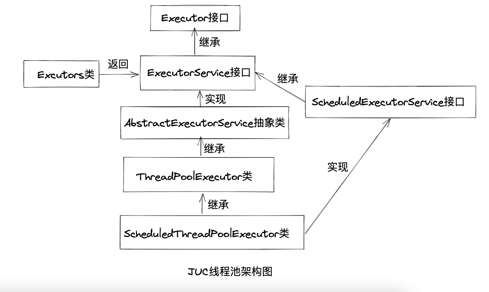

由于 Java 线程的创建、销毁都非常昂贵,需要 JVM 和 OS 配和完成大量的工作:

- **必须为线程堆栈分配和初始化大量内存块**。其中包含至少 1MB 的栈内存。
- 需要进行系统调用,以便在 OS 中创建和注册本地线程。

为了解决在高并发情况下频繁创建线程导致的资源开销较大问题,Java 提供了线程池,使用线程池具有如下好处:

- **降低创建线程带来的资源开销,提升性能**。线程池能独立负责线程的创建、维护和分配。在执行大量异步任务时,应将任务交给线程池调度,线程池会尽可能使用空闲的线程去执行异步任务,最大限度的对已创建的线程进行复用,从而提升性能。注意:
  在实际开发应禁止显式的创建线程,而是通过线程池创建线程,减少创建线程带来的资源开销。
- **易于线程管理**。每个 Java 线程池都会保持一些基本的线程信息,例如完成的任务数量、空闲时间等,以便于对线程进行有效的管理,使得调度更为高效。

## 1 JUC 线程池架构

JUC 是 java.util.concurrent 包的简称,该工具包是从 JDK1.5 加入 JDK 的,用于完成高并发,处理多线程的一个工具包。JUC 线程池架构如下:


### 1.1 Executor

Executor 是 Java 异步目标任务的"执行者"接口,其目标是执行目标任务。"执行者"Executor 提供了 execute()方法来执行已提交的 Runnable 实例。Executor 作为执行者角色,其目的是提供一种将"任务提交者'与"
任务执行者"分离开来的机制。Executor 仅包含一个函数式方法:

```java
void execute(Runnable command)
```

### 1.2 ExecutorService

ExecutorService 继承于 Executor 接口,它是 Java 异步目标任务的"执行者服务"接口,用于对外提供异步任务的接收服务。ExecutorService 提供了"接收异步任务并转交给执行者"
的方法,如 submit、invoke 等方法。

```java
// 向线程池提交单个任务
<T> Future<T> submit(Callable<T> task);
// 向线程池批量提交异步任务
<T> List<Future<T>>invokeAll(Collection<?extends Callable<T>> task)throws InterruptedException;
```

### 1.3 AbstractExecutorService

AbstractExecutorService 是一个抽象类,,它实现了 ExecutorService 接口。AbstractExecutorService 存在的目的是为 ExecutorService 中的接口提供默认实现。

### 1.4 ThreadPoolExecutor

ThreadPoolExecutor 是 Java 中线程池实现类,它继承于 AbstractExecutorService 抽象类。ThreadPoolExecutor 是 JUC 线程池的核心实现类。线程的创建和终止需要很大的资源开销,线程池中预先提供了指定数量的可重用线程,所以使用线程池会节省系统资源,并且每个线程池都维护了一些基础的数据统计功能,方便线程的管理和监控。

### 1.5 ScheduledExecutorService

ScheduledExecutorService 是一个接口,它继承于 ExecutorService。它是一个可以完成"延时"和"周期性"任务的调度线程池接口,其功能和 Timer/TimerTask 类似。

### 1.6 ScheduledThreadPoolExecutor

ScheduledThreadPoolExecutor 继承于 ThreadPoolExecutor,它提供了 ScheduledExecutorService 线程池接口中的"延时执行"和"周期性执行"等抽象调度方法的具体实现。ScheduledThreadPoolExecutor 类似于 Timer,但在高并发情况下,ScheduledThreadPoolExecutor 的性能优于 Timer。

### 1.7 Executors

Executors 是一个静态工厂类,它通过静态工厂方法返回 ExecutorService、ScheduledExecutorService 等线程池实例对象,这些静态工厂方法提供了创建线程池的快捷方式。

## 2 Executors 线程工厂类创建线程池

Executors 工厂类提供如下四种方式创建线程池:

- **newSingleThreadExecutor()**:创建只有一个线程的线程池。
- **newFixedThreadExecutor()**:创建固定大小的线程池。
- **newCachedThreadExecutor()**:创建一个不限制线程数量的线程池,任何提交的任务都将立即执行,但空闲线程会得到及时回收。
- **newScheduleThreadExecutor()**:创建一个可定期或延时执行任务的线程池。

### 2.1 newSingleThreadExecutor

newSingleThreadExecutor()用于创建一个"单线程化线程池",也就是只有一个线程的线程池,所创建的线程用唯一的工作线程来执行任务,使用此方法创建的线程池能保证所有任务按照指定顺序执行(如 FIFO)。单线程化的线程池适用于:任务按照提交次序,任务逐个执行的场景。

```java
package com.fly.pool;

import java.util.concurrent.ExecutorService;
import java.util.concurrent.Executors;
import java.util.concurrent.atomic.AtomicInteger;

/**
 * newSingleThreadExecutor()用于创建一个"单线程化线程池",也就是只有一个线程的线程池,
 * 所创建的线程用唯一的工作线程来执行任务,使用此方法创建的线程池能保证所有任务按照
 * 指定顺序执行(如FIFO)。
 */
public class ThreadPool01 {
    // 线程睡眠间隔时间
    public static final int SLEEP_GAP = 500;

    public static void main(String[] args) throws InterruptedException {
        ExecutorService pool = Executors.newSingleThreadExecutor();

        // 遍历5次共创建10个线程
        for (int i = 0; i < 5; i++) {
            pool.execute(new Task());
            pool.submit(new Task());
        }
        // 当前线程休眠1000ms
        Thread.sleep(1000);
        // 关闭线程池,使线程池的状态变为STOP
        pool.shutdown();
    }

    static class Task implements Runnable {
        // 声明int类型原子用于作为线程任务编号
        static AtomicInteger taskNo = new AtomicInteger(1);
        private String taskName;

        public Task() {
            taskName = "task-" + taskNo.get();
            // int原子类数值+1
            taskNo.incrementAndGet();
        }

        @Override
        public void run() {
            System.out.println("任务:" + taskName + " run start...");
            try {
                Thread.sleep(SLEEP_GAP);
            } catch (InterruptedException e) {
                e.printStackTrace();
            }
            System.out.println("任务" + taskName + " run end...");
        }
    }
}
```

执行结果:

```latex
任务:task-1 run start...
任务task-1 run end...
任务:task-2 run start...
任务task-2 run end...
任务:task-3 run start...
任务task-3 run end...
任务:task-4 run start...
任务task-4 run end...
任务:task-5 run start...
任务task-5 run end...
任务:task-6 run start...
任务task-6 run end...
任务:task-7 run start...
任务task-7 run end...
任务:task-8 run start...
任务task-8 run end...
任务:task-9 run start...
任务task-9 run end...
任务:task-10 run start...
任务task-10 run end...
```

从执行结果可以看出,newSingleThreadExecutor()线程池具有如下特点:

- 单线程化的线程池中的任务是按照提交的次序顺序执行的。
- 线程池中的线程存活时间是无限的。
- 当线程池中唯一的线程正繁忙时,新提交的任务实例会进入阻塞队列中,并且阻塞队列是无界的。

### 2.2 newFixedThreadExecutor

newFixedThreadExecutor()用于创建一个固定数量的线程池,其唯一的参数用于设置线程池中的线程的固定数量。

```java
package com.fly.pool;

import java.util.concurrent.ExecutorService;
import java.util.concurrent.Executors;
import java.util.concurrent.atomic.AtomicInteger;

public class ThreadPool02 {
    // 线程睡眠间隔时间
    public static final int SLEEP_GAP = 500;

    static class Task implements Runnable {
        // 声明int类型原子用于作为线程任务编号
        static AtomicInteger taskNo = new AtomicInteger(1);
        private String taskName;

        public Task() {
            taskName = "task-" + taskNo.get();
            // int原子类数值+1
            taskNo.incrementAndGet();
        }

        @Override
        public void run() {
            System.out.println("任务:" + taskName + " run start...");
            try {
                Thread.sleep(SLEEP_GAP);
            } catch (InterruptedException e) {
                e.printStackTrace();
            }
            System.out.println("任务" + taskName + " run end...");
        }
    }

    public static void main(String[] args) throws InterruptedException {
        // 创建3个线程的线程池
        ExecutorService pool = Executors.newFixedThreadPool(3);
        for (int i = 0; i < 5; i++) {
            pool.execute(new Task());
            pool.submit(new Task());
        }
        // 当前线程休眠1000ms
        Thread.sleep(1000);
        // 关闭线程池
        pool.shutdown();
    }
}
```

执行结果:

```latex
任务:task-1 run start...
任务:task-2 run start...
任务:task-3 run start...
任务task-1 run end...
任务:task-4 run start...
任务task-2 run end...
任务:task-5 run start...
任务task-3 run end...
任务:task-6 run start...
任务task-5 run end...
任务:task-7 run start...
任务task-4 run end...
任务:task-8 run start...
任务task-6 run end...
任务:task-9 run start...
任务task-8 run end...
任务task-9 run end...
任务task-7 run end...
任务:task-10 run start...
任务task-10 run end...
```

从执行结果来看,创建了线程数为 3 的固定数量线程池,向该线程池中提交了 10 个任务,该线程池同时只能处理 3 个任务,其余任务会排队等待。固定数量线程池的特点如下:

- 如果线程数没有到达固定数量,每次提交一个线程任务线程池都会创建一个新的线程,直到线程达到线程池固定数量。
- 线程池的大小一旦达到了固定数量就会保持不变,如果某个线程因执行异常而结束,那么线程池会补充一个新的线程。
- 在接收异步任务的执行目标实例时,如果线程池中的所有线程都处于繁忙状态,则新任务会进入阻塞队列(无界的阻塞队列)。

固定线程池适用于:适合需要任务长期执行的场景。固定数量的线程池的线程可以保持一个稳定的数量,能够避免频繁创建和回收线程,所有适用于处理 CPU 密集型的任务,在 CPU 被工作线程长时间占用的情况下,能确保尽可能的分配线程。

:::danger
注意:**由于固定数量线程池内部使用无界队列来存储任务,当大量任务超过线程最大容量需要处理时,队列无限增大,使服务器资源迅速耗尽,造成 OOM(内存溢出)**。
:::

### 2.3 newCachedThreadExecutor

newCachedThreadExecutor()用于创建一个可缓存的线程池,如果线程池的内某些线程处于空闲状态称为空闲线程,可缓存线程池可以灵活回收这些空闲线程。

```java
package com.fly.pool;

import java.util.concurrent.ExecutorService;
import java.util.concurrent.Executors;
import java.util.concurrent.atomic.AtomicInteger;

public class ThreadPool03 {

    // 线程睡眠间隔时间
    public static final int SLEEP_GAP = 500;

    public static void main(String[] args) throws InterruptedException {
        ExecutorService pool = Executors.newCachedThreadPool();
        for (int i = 0; i < 5; i++) {
            pool.execute(new Task());
            pool.submit(new Task());
        }
        Thread.sleep(1000);
        pool.shutdown();
    }

    static class Task implements Runnable {
        // 声明int类型原子用于作为线程任务编号
        static AtomicInteger taskNo = new AtomicInteger(1);
        private String taskName;

        public Task() {
            taskName = "task-" + taskNo.get();
            // int原子类数值+1
            taskNo.incrementAndGet();
        }

        @Override
        public void run() {
            System.out.println("任务:" + taskName + " run start...");
            try {
                Thread.sleep(SLEEP_GAP);
            } catch (InterruptedException e) {
                e.printStackTrace();
            }
            System.out.println("任务" + taskName + " run end...");
        }
    }
}
```

执行结果:

```latex
任务:task-1 run start...
任务:task-2 run start...
任务:task-3 run start...
任务:task-4 run start...
任务:task-5 run start...
任务:task-6 run start...
任务:task-7 run start...
任务:task-8 run start...
任务:task-9 run start...
任务:task-10 run start...
任务task-1 run end...
任务task-3 run end...
任务task-2 run end...
任务task-4 run end...
任务task-5 run end...
任务task-7 run end...
任务task-6 run end...
任务task-8 run end...
任务task-9 run end...
任务task-10 run end...
```

可缓存线程池特点如下:

- 在接收新任务时如果池内所有线程都处于繁忙状态,此线程池就会创建一个新的线程来处理任务。
- 此线程池不会对线程池大小进行限制,线程池大小完全依赖于操作系统(或 JVM)能够创建的最大线程池大小。
- 如果部分线程空闲(即存量线程超过了处理任务数量),就会回收空闲线程(60s 不执行任务)。

可缓存线程池适用于:需要快速处理突发性强、耗时短的任务场景,如 Netty 的 NIO 场景、REST API 接口的瞬时削峰场景。 注意:由于可缓存线程池没有最大线程数量限制,如果同时提交大量的任务,可能会因创建线程过多而导致资源耗尽,造成 OOM(内存溢出)。

### 2.4 newScheduleThreadExecutor

newScheduleThreadExecutor()用于创建一个可调度线程池,即提供延时和周期性任务调度功能的 ScheduleExecutorService 类型的线程池。Executors 线程池工厂类提供了多种创建可调度线程池的工厂方法。

```java
// 方法1:创建一个可调度线程池,池内只有一个线程。适用于串行化任务调度
public static ExecutorService newSingleThreadExecutor();
// 方法2:创建一个可调度线程池,池内有corePoolSize个线程池
public static ScheduledExecutorService newScheduledThreadPool(int corePoolSize)
```

```java
package com.fly.pool;

import java.util.concurrent.ExecutorService;
import java.util.concurrent.Executors;
import java.util.concurrent.ScheduledExecutorService;
import java.util.concurrent.TimeUnit;
import java.util.concurrent.atomic.AtomicInteger;

public class ThreadPool04 {
    // 线程睡眠间隔时间
    public static final int SLEEP_GAP = 500;

    public static void main(String[] args) throws InterruptedException {
        ScheduledExecutorService pool = Executors.newScheduledThreadPool(2);
        for (int i = 0; i < 5; i++) {
            /**
             * scheduleAtFixedRate()用于创建并执行一个周期性任务,该任务在给定的初始延迟后首先启用,
             * 然后在给定的周期内启用。该方法参数如下
             * command:需要调度执行的任务(Runnable接口实例)。
             * long initialDelay:首次执行任务延迟时间。
             * long period:每次执行任务的间隔时间。
             * TimeUnit unit:时间单位。
             */
            pool.scheduleAtFixedRate(new Task(), 0, 500, TimeUnit.MILLISECONDS);
        }
        Thread.sleep(1000);
        pool.shutdown();
    }

    static class Task implements Runnable {
        // 声明int类型原子用于作为线程任务编号
        static AtomicInteger taskNo = new AtomicInteger(1);
        private String taskName;

        public Task() {
            taskName = "task-" + taskNo.get();
            // int原子类数值+1
            taskNo.incrementAndGet();
        }

        @Override
        public void run() {
            System.out.println("任务:" + taskName + " run start...");
            try {
                Thread.sleep(SLEEP_GAP);
            } catch (InterruptedException e) {
                e.printStackTrace();
            }
            System.out.println("任务" + taskName + " run end...");
        }
    }
}
```

执行结果:

```latex
任务:task-1 run start...
任务:task-2 run start...
任务task-2 run end...
任务task-1 run end...
任务:task-3 run start...
任务:task-4 run start...
任务task-3 run end...
任务task-4 run end...
```

ScheduledExecutorService 接口中有多个重要的调度方法,其中最为常用的是`scheduleAtFixedRate()`和`scheduleWithFixedDelay()`,两者参数作用都是相同的。

:::danger
注意:当任务的执行时间大于指定的间隔时间,ScheduledExecutorService 并不会创建一个新的线程去并发执行该任务,而是等待前一次任务调度执行完毕,而且执行任务时出现异常导致取消或终止执行器,也会影响后续任务执行,所以可调度线程池并不能保证任务准时执行。
:::

## 3.ThreadPoolExecutor

Executors 线程池工厂类虽然提供了创建线程池的便捷方式(其内部也基于 ThreadPoolExecutor,定时任务基于 ScheduledThreadPoolExecutor)
,但在阿里巴巴开发手册明确规定禁止使用 Executors 创建线程池,推荐使用 ThreadPoolExecutor 线程池创建线程,原因如下:

- **newFixedThreadPool()和 newSingleThreadPool()线程池内部处理的队列为无界队列,允许的队列长度为**`**Integer.MAX_VALUE**`**,在处理大量任务时会导致任务堆积,从而导致 OOM(内存溢出)。**
- **newCachedThreadPool()允许的创建线程数量为**`**Integer.MAX_VALUE**`**,可能会创建大量的线程,从而导致 OOM(内存溢出)**。

ThreadPoolExecutor 提供了多个构造方法重载,最重要的一个构造器如下:

```java
   public ThreadPoolExecutor(int corePoolSize,
        int maximumPoolSize,
        long keepAliveTime,
        TimeUnit unit,
        BlockingQueue<Runnable> workQueue,
        ThreadFactory threadFactory,
        RejectedExecutionHandler handler)
```

- **corePoolSize 和 maximumPoolSize**:corePoolSize 用于设置线程池核心线程数量,maximumPoolSize 用于设置最大线程数量。线程池执行器会根据 corePoolSize 和 maximumPoolSize 自动维护线程池中的工作线程,工作流程如下:
  - 当线程池接收新任务,并且当前的工作线程少于 corePoolSize 时,即使其他工作线程处于空闲状态,线程池也会创建一个新的线程处理任务,直到线程数为 corePoolSize。
  - 如果当前工作线程数多于 corePoolSize,但小于 maximumPoolSize,那么只有任务排队队列已满时才会创建新的线程。通过设置 corePoolSize 和 maximumPoolSize 相同数量,可以创建一个固定大小的线程池。
  - 当 maximumPoolSize 被设置为无界值(如`Integer.MAX_VALUE`)时,线程池可以接收任意数量的并发任务。
  - corePoolSize 和 maximumPoolSize 可以通过 setCorePoolSize()和 setMaximumPoolSize()设置。
- **keepAliveTime**:线程构造器的 keepAliveTime(空闲线程存活时间)参数用于设置池内线程最大 Idle(空闲)时间(或者说包活时间)
  ,如果超过该时间,默认情况下空闲和非核心线程会被回收。Idle 超时策略仅适用与存在超过 corePoolSize 线程的情况。但若调用了 allowCoreThreadTimeOut(boolean)
  方法,并且传入的参数为 true,则 keepAliveTime 参数所设置的 Idle 超时策略也将被应用于核心线程。
- **unit**:线程 keepAliveTime(存活时间)的时间单位。
- **workQueue**:BlockingQueue(阻塞队列)的实例用于暂时存储异步任务。如果线程池的核心线程都在忙,那么所接收到的目标任务缓存在阻塞队列中。
- **threadFactory**:线程工厂。线程工厂用于创建线程。
- **handler**:线程拒绝策略。

### 3.1 通过 execute()或 submit()向线程池提交任务

execute()和 submit()两者都可以向线程池中提交任务,两者区别如下:

- execute()仅支持 Runnable 接口实例,而 submit()既支持 Runnable 接口又支持 Callable 接口。
- execute()无返回值,submit()返回一个 Future 对象,通过 Future 的 get()可以获取任务的执行结果。
- execute()不支持声明异常,submit()支持支持声明异常,submit()返回的 Future 对象在调用 get()获取执行结果时,可以捕获异步执行过程中所抛出的受检异常和运行时异常。submit()源码最终还是调用 execute()执行任务。

```java
package com.fly.pool;

import java.util.concurrent.*;

public class ThreadPool05 {
    public static void main(String[] args) throws ExecutionException, InterruptedException {
        // 核心线程数
        final int corePoolSize = 2;
        // 最大线程数
        final int maximumPoolSize = 4;
        // 线程存活时间
        final int keepAliveTime = 10000;
        // 存活时间单位
        final TimeUnit unit = TimeUnit.MILLISECONDS;
        // 阻塞队列,用于存储线程池提交任务
        LinkedBlockingQueue queue = new LinkedBlockingQueue<>();
        // 线程工厂用于创建线程
        ThreadFactory factory = new ThreadFactory() {
            @Override
            public Thread newThread(Runnable r) {
                return new Thread(r);
            }
        };
        // 线程池拒绝策略
        RejectedExecutionHandler handler = new RejectedExecutionHandler() {
            @Override
            public void rejectedExecution(Runnable r, ThreadPoolExecutor executor) {

            }
        };
        ThreadPoolExecutor pool = new ThreadPoolExecutor(corePoolSize, maximumPoolSize,
                keepAliveTime, unit, queue, factory, handler);
        // execute提交Runnable实例任务
        pool.execute(() -> {
            System.out.println("ThreadPoolExecutor execute Runnable task...");
        });
        // submit提交Runnable实例任务
        pool.submit(() -> {
            System.out.println("ThreadPoolExecutor submit Runnable task...");
        });
        // submit提交Callable实例任务
        Future<String> future = pool.submit(() -> {
            System.out.println("ThreadPoolExecutor submit Callable task...");
            return "Callable";
        });
        Thread.sleep(1000L);
        // 终止线程池
        pool.shutdown();
        System.out.println("执行结果:" + future.get());
    }
}
```

执行结果:

```latex
ThreadPoolExecutor execute Runnable task...
ThreadPoolExecutor submit Runnable task...
ThreadPoolExecutor submit Callable task...
执行结果:Callable
```

### 3.2 线程池任务调度流程

线程池的调度流程如下:

- 如果当前工作线程数小于核心线程数,执行器总是优先创建一个新的任务线程,而不是从线程队列中获取一个空闲线程。
- 如果当前工作线程数大于核心线程池,线程池所接收的任务将被加入到阻塞队列中,一直到阻塞队列已满。在核心线程数量已经用完,但阻塞队列未满的情况下,线程池并不会为新任务创建一个新的线程。
- 当执行完一个任务时,执行器总是优先从阻塞队列中获取下一个任务并开始执行,一直到阻塞队列为空。
- 在核心线程池数量已经用完、阻塞队列已满的情况下,如果线程池接收到新的任务,将会为新任务创建一个线程(非核心线程),并立即执行新的任务。
- 在核心线程都用完、阻塞队列已满的情况下,一直会创建新的线程执行新任务,直到线程池内的线程数量超出 maximumPoolSize。如果线程池的线程总数超过 maximumPoolSize,线程池就会拒绝接收任务,当接收新任务时,会为新任务执行拒绝策略。


### 3.3 ThreadFactory 线程工厂

ThreadFactory 是 Java 线程工厂接口,内部仅提供了`newThread(Runnable target)`一个方法用于创建线程,newThread()创建线城时可以更改创建线程的名称、线程组、优先级、守护进程状态等。如果 newThread()
的返回值为 null,表示线程工厂未成功创建线程,线程池可能无法执行任何任务。基于自定义的 ThreadFactory 实例创建线程池,需要实现 ThreadFactory 接口中的 newThread()方法。

使用 Executors 创建新的线程池时,也可以基于 ThreadFactory 创建,在创建线程池是可以指定将要使用的 ThreadFactory 实例。如果未指定 ThreadFactory 实例,则 Executors 会使用 Executors.defaultThreadFactory 作为默认实例,使用默认实例创建的线程全部都位于同一个线程组(ThreadGroup),具有相同的优先级,而且都是非守护进程状态。

### 3.4 BlockingQueue(阻塞队列)

Java 中的阻塞队列与普通队列相比有一个重要的特点:在阻塞队列为空时会阻塞当前线程获取元素操作。简单来说,一个线程从一个空的阻塞队列中获取元素时会被阻塞,直到阻塞队列中不为空(添加元素);当队列不为空后,被阻塞的线程会自动被唤醒。
Java 线程池使用 BlockingQueue 实例暂时存储异步任务,BlockingQueue 是 JUC 包下的一个超级接口,常用的实现类有:

- **ArrayBlockingQueue**:是一个数组实现的有界阻塞队列,队列中的元素按 FIFO 排序。ArrayBlockingQueue 在创建时必须执行大小(有界)
  ,当接收的任务超出 corePoolSize 数量时,任务会被缓存到该阻塞队列中,任务的缓存最大数量只能为创建队列时设置的大小,若该阻塞队列已满,则会为新的任务创建线程,知道线程池的线程总数大于 maximumPoolSize。
- **LinkedBlockingQueue**:是一个基于链表实现的阻塞队列,按 FIFO 排序任务,可以实现容量(有界队列),默认容量为 Integer.MAX_VALUE(无界队列)。该队列的吞吐量高于 ArrayBlockingQueue。如果不设置 LinkedBlockingQueue 的容量(无界队列),当接收的任务超出 corePoolSize 时,则新任务可以被无界队列无限制的存储缓存到阻塞队列中,直到资源耗尽,造成 OOM。Executors 提供了 newSingleThreadExecutor 和 newFixedThreadPool 内壁都使用了 LinkedBlockingQueue,并且都没有设置容量(无界队列)。
- **PriorityBlockingQueue**:具有优先级的无界队列。
- **DelayQueue**:一个无界阻塞延迟队列,底层基于 PriorityBlockingQueue 实现,队列中每个元素都有一个过期时间,当从队列获取元素时(元素出队),只有已经过期的元素才会出队,队列头部的元素是过期最快的元素。Executors.newScheduledThreadPool 所创建的线程池底层基于 DelayQueue。
- **SynchronousQueue**:同步队列,该队列是一个不存储元素的阻塞队列,每个插入操作必须等待另一个线程的调用移除操作,否则插入操作一直处于阻塞状态,其吞吐量通常高于 LinkedBlockingQueue。Executors.newCachedThreadPool 底层基于该队列实现。SynchronousQueue 队列比较特殊,它不会保存提交的任务,而是直接新建一个线程来执行新任务。

### 3.5 线程池拒绝策略

当线程池的阻塞队列为有界队列时,如果队列满了,提供任务到线程池的时就会被拒绝,任务拒绝有以下两种情况:

- **线程池已经被关闭**。
- **工作队列已满且 maximumPoolSize 已满**。

以上两种情况线程池都会执行拒绝策略,线程池会调用 RejectedExecutionHandler 实例的 rejectedExecution()
拒绝任务。RejectedExecutionHandler 线程池拒绝策略接口,JUC 为该接口提供了如下几种实现:

- **AbortPolicy**:拒绝策略。使用该策略时,如果线程池队列满了,新任务就会被拒绝,并且抛出 RejectedExecution 异常。该策略是线程池默认的拒绝策略。
- **DiscardPolicy**:抛弃策略。该策略是 AbortPolicy 的安静(Silent)版本,如果线程池队列满了,新任务就会直接被拒绝,并且不会抛出任何异常。
- **DiscardOldestPolicy**:抛弃最旧任务策略。该策略会丢弃最早进入队列的任务,丢弃任务后会添加新任务。
- **CallerRunPolicy**:调用者执行策略。在新任务被添加线程池时,如果添加失败,那么提交任务线程会自己去执行该任务,不会使用线程池中的线程执行新任务。
- **自定义策略**。自定义拒绝策略需要实现 RejectedExecutionHandler 接口并重写 rejectedExecution()。

```java
package com.fly.pool;

import java.util.PriorityQueue;
import java.util.concurrent.*;

public class ThreadPool06 {
    public static void main(String[] args) {
        // 核心线程数
        final int corePoolSize = 2;
        // 最大线程数
        final int maximumPoolSize = 4;
        // 线程存活时间
        final int keepAliveTime = 10000;
        // 存活时间单位
        final TimeUnit unit = TimeUnit.MILLISECONDS;

        // 数组阻塞队列
        BlockingQueue<Runnable> arrayQueue = new ArrayBlockingQueue(128);
        // 链表阻塞队列,内部基于链表实现
        BlockingQueue<Runnable> linkedQueue = new LinkedBlockingQueue();
        // 优先级阻塞队列
        BlockingQueue<Runnable> priorityBlockingQueue = new PriorityBlockingQueue(128);
        // 延迟队列
        BlockingQueue<Runnable> delayQueue = new DelayQueue();
        // 同步队列
        BlockingQueue<Runnable> syncQueue = new SynchronousQueue();


        // 线程工厂用于创建线程
        ThreadFactory factory = new ThreadFactory() {
            // newThread()用于创建线程,Runnable实例将作为Thread构造器目标执行器
            @Override
            public Thread newThread(Runnable r) {
                return new Thread(r);
            }
        };

        // 拒绝策略。线程池默认拒绝策略,rejectedExecution()方法可能会抛出RejectedExecutionException异常
        RejectedExecutionHandler abortPolicy = new ThreadPoolExecutor.AbortPolicy();
        // 安静版本的拒绝策略,rejectedExecution()不会抛出任何异常
        RejectedExecutionHandler discardPolicy = new ThreadPoolExecutor.DiscardPolicy();
        // 抛弃最旧任务策略。丢弃最早进入队列的任务
        RejectedExecutionHandler discardOldestPolicy = new ThreadPoolExecutor.DiscardOldestPolicy();
        // 调用者执行策略。如果当前任务到线程池失败,则任务会被提交线程执行
        RejectedExecutionHandler callerRunsPolicy = new ThreadPoolExecutor.CallerRunsPolicy();
        // 自定义拒绝策略。丢弃队列中所有任务并新任务
        RejectedExecutionHandler customizePolicy = new RejectedExecutionHandler() {
            @Override
            public void rejectedExecution(Runnable r, ThreadPoolExecutor e) {
                if (!e.isShutdown()) {
                    // 丢弃队列中所有任务
                    e.getQueue().clear();
                    // 执行新任务
                    e.execute(r);
                }
            }
        };

        ThreadPoolExecutor pool = new ThreadPoolExecutor(corePoolSize, maximumPoolSize, keepAliveTime, unit, linkedQueue, factory, abortPolicy);
        pool.execute(() -> {
            System.out.println("创建线程池...");
        });
        // 终止线程池
        pool.shutdown();
    }
}
```

### 3.6 线程池调度钩子

ThreadPoolExecutor 线程池调度器为每个任务执行前后都提供了钩子方法。ThreadPoolExecutor 类提供了三个钩子方法(空方法),这三个钩子方法一般被子类重写。

```java
// 任务执行前的钩子方法
protected void beforeExecute(Thread t,Runnable r){}
// 任务执行完毕后的钩子方法
protected void afterExecute(Runnable r,Throwable t){}
// 线程池终止时执行的钩子方法
protected void terminated(){}
```

- **beforeExecute()**:线程池工作线程在异步执行目标实例(如 Runnable 实例)前调用此钩子方法。此方法仍然由执行任务的工作线程调用(工作线程可能失败并突然终止)。默认实现不执行任何操作,但可以在子类中对齐进行自定义。
- **afterExecute()**:线程池工作线程在异步执行目标实例后调用该钩子方法。此方法仍然由执行任务的工作线程调用(工作线程可能失败并突然终止)
  。此钩子方法的默认实现不执行任何操作,可以在调度器子类对其进行自定义。此方法由执行目标实例的工作线程调用,可用于清除 ThreadLocal 线程本地变量、更新日志记录、收集统计信息、更新上下文变量等。
- **terminated()**:terminated 钩子方法在线程池执行调用,默认实现不执行任何操作。

```java
package com.fly.pool;

import java.util.concurrent.ExecutorService;
import java.util.concurrent.LinkedBlockingQueue;
import java.util.concurrent.ThreadPoolExecutor;
import java.util.concurrent.TimeUnit;
import java.util.concurrent.atomic.AtomicLong;

public class ThreadPool07 {
    public static void main(String[] args) throws InterruptedException {
        AtomicLong time = new AtomicLong(0);

        ExecutorService pool = new ThreadPoolExecutor(2, 4, 60, TimeUnit.SECONDS, new LinkedBlockingQueue(2)) {

            // 线程池终止执行的钩子方法
            @Override
            protected void terminated() {
                System.out.println("调度器被终止!");
                super.terminated();
            }

            // 线程池执行前钩子方法
            @Override
            protected void beforeExecute(Thread t, Runnable r) {
                System.out.println(r + "前置钩子方法执行");
                time.set(System.currentTimeMillis());
                super.beforeExecute(t, r);
            }

            // 线程池执行后钩子方法
            @Override
            protected void afterExecute(Runnable r, Throwable t) {
                // 计算任务执行时长
                long endTime = System.currentTimeMillis() - time.get();
                System.out.println(r + "后置钩子方法执行,耗时:" + endTime);
                super.afterExecute(r, t);
            }
        };
        for (int i = 0; i < 5; i++) {
            int index = i + 1;
            pool.execute(new Runnable() {
                @Override
                public void run() {
                    System.out.println("执行任务" + index);
                    try {
                        // 模拟执行任务耗时
                        Thread.sleep(200);
                    } catch (InterruptedException e) {
                        e.printStackTrace();
                    }
                }
            });
        }
        Thread.sleep(100);
        pool.shutdown();
    }
}
```

执行结果:

```latex
com.fly.pool.ThreadPool07$2@66a1da4f前置钩子方法执行
com.fly.pool.ThreadPool07$2@51f2b19d前置钩子方法执行
com.fly.pool.ThreadPool07$2@54485d89前置钩子方法执行
执行任务5
执行任务1
执行任务2
com.fly.pool.ThreadPool07$2@54485d89后置钩子方法执行,耗时:204
com.fly.pool.ThreadPool07$2@66a1da4f后置钩子方法执行,耗时:204
com.fly.pool.ThreadPool07$2@51f2b19d后置钩子方法执行,耗时:204
com.fly.pool.ThreadPool07$2@5a8fa970前置钩子方法执行
com.fly.pool.ThreadPool07$2@686638eb前置钩子方法执行
执行任务4
执行任务3
com.fly.pool.ThreadPool07$2@686638eb后置钩子方法执行,耗时:201
com.fly.pool.ThreadPool07$2@5a8fa970后置钩子方法执行,耗时:201
调度器被终止!
```

### 3.7 关闭线程池

注意:线程池使用完毕务必要关闭线程池,大部分情况下推荐手动关闭线程池。线程池和线程一样都有状态,线程池提供了五种状态,定义在 ThreadPoolExecutor 类中:

```java
public class ThreadPoolExecutor extends AbstractExecutorService {
    private static final int COUNT_BITS = Integer.SIZE - 3;

    private static final int RUNNING = -1 << COUNT_BITS;
    private static final int SHUTDOWN = 0 << COUNT_BITS;
    private static final int STOP = 1 << COUNT_BITS;
    private static final int TIDYING = 2 << COUNT_BITS;
    private static final int TERMINATED = 3 << COUNT_BITS;
}
```

- RUNNING:运行状态。线程池创建后的初始状态,在该状态下可以执行任务。
- SHUTDOWN:关闭状态。该状态下线程池不再接收新任务,但是会将工作队列中的任务执行完毕。调用线程池的 shutdown()方法会使 RUNNING 状态变为 SHUTDOWN 状态。
- STOP:停止状态。该状态下线程池不再接收新任务,也不会处理工作队列中的剩余任务,并且将会中断所有工作线程。
- TIDYING:整理状态。该状态下所有任务都已终止或处理完成,将会执行 terminated()钩子方法。
- TERMINATED:终止状态。执行完 terminated()钩子方法执行后的状态。

ThreadPoolExecutor 提供了三个方法用于关闭线程池:

- **shutdown()**:是 JUC 提供的一个有序关闭现成池的方法,此方法会等待当前工作队列中的剩余任务全部执行完成之后,才会执行关闭。调用此方法后线程池的状态变为 SHUTDOWN,且线程池不会接收新的任务。
- **shutdownNow()**:是 JUC 提供了一个立即关闭线程池的方法,此方法会打断正在执行的工作线程,并且会清空当前工作队列中的剩余任务,返回的是尚未执行的任务。
- **awaitTermination()**:等待线程池完成再关闭线程池。在调用线程池的 shutdown()与 shutdownNow()时,当前线程会立即返回,不会一直等待直到线程池完成,而 awaitTermination()会等待线程池中所有任务执行完成后才会关闭线程池,awaitTermination()接收一个超时时间和时间单位,当发生超时,或者当前线程被中断都会终止线程池,但会抛出 java.lang.InterruptedException 异常。

### 3.8 注册 JVM 钩子函数自动关闭线程池

如果使用了线程池,可以在 JVM 中注册一个钩子函数,在 JVM 进程关闭之前,有钩子函数自动将线程池关闭,以确保资源正常释放。

```java
package com.fly.pool;

import java.util.concurrent.ScheduledThreadPoolExecutor;
import java.util.concurrent.ThreadFactory;

public class ThreadPool09 {
    public static void main(String[] args) {
        ScheduledThreadPoolExecutor executor =
                new ScheduledThreadPoolExecutor(1, new ThreadFactory() {
                    @Override
                    public Thread newThread(Runnable r) {
                        return new Thread(r);
                    }
                });
        Thread thread = new Thread(new Runnable() {
            @Override
            public void run() {
                System.out.println("JVM Hook");
                // 关闭线程池
                executor.shutdown();
            }
        });
        /**
         * Runtime.getRuntime().addShutdownHook()用于添加一个jvm钩子方法,
         * 当JVM关闭时,会执行系统中已经设置的所有通过方法addShutdownHook添加的钩子,
         * 钩子执行完毕后JVM才会关闭。钩子方法通常在JVM关闭时进行内存清理、对象销毁等操作
         */
        Runtime.getRuntime().addShutdownHook(thread);
    }
}
```

## 4.确定线程池的线程数

虽然线程池优点很多(降低资源消耗提升性能,支持线程管理),如果线程池的线程数配置的不合理,不仅达不到提升性能效果,反而可能会降低应用的性能。
使用 ThreadPoolExecutor 创建线程池会涉及到线程数的配置,线程池的线程数的配置与处理的异步任务相关,线程池的异步任务大致分为三类:

- IO 密集型任务:IO 密集型任务主要是执行 IO 操作,例如网络 IO、磁盘读写 IO 等等。由于执行 IO 的操作时间较长,导致 CPU 的利用率不高,造成 CPU 常处于空闲状态。
- CPU 密集型任务:CPU 密集型任务主要是执行计算任务,例如统计金额、数据排序归并等等。由于响应时间很快,CPU 一直在运行,执行 CPU 密集型任务 CPU 利用率很高。
- 混合型任务:混合型任务是既要执行逻辑运算,又要进行 IO 操作(如 RPC 调用、数据库访问)。相对来说,由于执行 IO 操作耗时较长(一次网络 IO 通常在数百毫秒级别),所以混合型任务的 CPU 利用率也不是很高。Web 服务器的 HTTP 请求处理操作就是混合型任务的典型例子。

### 4.1 IO 密集型任务设置线程数

**由于 IO 密集型任务的 CPU 使用率较低,导致线程空闲时间很多,对于 IO 密集型任务通常设置 CPU 核心数的两倍。当 IO 线程空闲,可以启用其他线程继续使用 CPU,以提高 CPU 的使用率**。

### 4.2 CPU 密集型任务设置线程数

CPU 密集型任务又叫计算型密集型任务,其特点是要进行大量计算而需要消耗 CPU 资源,例如计算圆周率、视频编解码等等。CPU 密集型任务虽然可以并行执行,并行执行的任务越多,切换线程的时间也会花的越多。**为了高效的利用 CPU 资源,CPU 密集型任务线程数应设为 CPU 的核心数**。如果线城数超过 CPU 核心数,执行任务时就需要频繁的切换线程,而线程上下文切换是一个比较耗时的操作,反而会影响任务的执行效率。在 Java 中可以通过`Runtime.getRuntime().availableProcessors();`获取当前计算机 CPU 核心数。

### 4.3 混合型任务设置线程数

混合型任务既要执行逻辑运算,又要进行大量 IO 操作,对于混合型任务设置的线程数公式如下:

```latex
最佳线程数 = ((线程等待时间 + 线程CPU时间 ) / 线程CPU时间 ) * CPU核数
// 简化公式
最佳线程数 = (线程等待时间与线程CPU时间之比 + 1) * CPU核数
```

从公式可以看出线程等待时间占比越高,需要的线程的越多;CPU 耗时所占的比例越高,需要的线程就越少。

## 5.使用线程池的注意事项

- 禁止使用 Executors 线程池工厂创建线程。
- 任务执行导致异常丢失问题。解决方式有如下四种:
  - 在任务内部添加 try/catch 进行异常处理。
  - 如果基于 Future 对象,可以通过 Future 对象的 get()接收抛出的异常。
  - 如果工作线程设置 setUncaughtExceptionHandler,则在 uncaughtException 方法中处理异常。
  - 可以重写 afterExecute(Runnable r, Throwable t) 方法获取异常 t。
- 避免共享线程池。整个服务共享一个全局线程池,导致任务相互影响,耗时长的任务占满资源,短耗时任务得不到执行。同时父子线程间会导致死锁的发生,进而导致 OOM。
- 线程池搭配 ThreadLocal 使用会导致脏数据。Tomcat 利用线程池来处理收到的请求,会复用线程,如果代码中使用了 ThreadLocal,在请求处理完后没有去 remove,那每个请求就有可能获取到之前请求遗留的脏值。
- ThreadLocal 在线程池场景下会失效,可以考虑用阿里开源的 Ttl 来解决。
- 自定义线程工厂需要指定线程名称。当线程池出现问题时可根据线程名称快速定位问题。

## 6.ThreadPoolExecutor 源码剖析

## 7.dynamic-tp 轻量级动态线程池

虽然使用 ThreadPoolExecutor 创建线程池能快捷的创建线程池,但具有如下缺点:

- 无法确定 ThreadPoolExecutor 的核心线程数。通常在上线前会在服务器上测试线程池,以得出最优线程池参数。
- 无法动态设置线程池参数。每次设置线程池参数都需要重启服务才会生效。
- 无法监控线程池的运行情况。线程池相对开发人员来说是个黑盒,运行情况不能及时感知到,直到出现问题。
